# Assignment 3 — Production Maintenance Drill (OPS Checklist)

Part of the DevOps Micro Internship (DMI) Cohort 3 with Agentic AI

---

## Purpose

In this assignment, you will treat your already deployed React application (on Ubuntu VM with Nginx) as a live production system. You will perform structured operational checks covering network validation, service health, log analysis, resource monitoring, configuration verification, and incident simulation with recovery — mirroring real on-call DevOps responsibilities.

---

# Task 1 — Server Access & Networking Validation

## Goal

Verify that the deployed React application is reachable from the browser and confirm basic network connectivity of the Ubuntu VM.

### Evidence

#### Screenshot 1 — Browser showing the React app with your Full Name visible on the UI

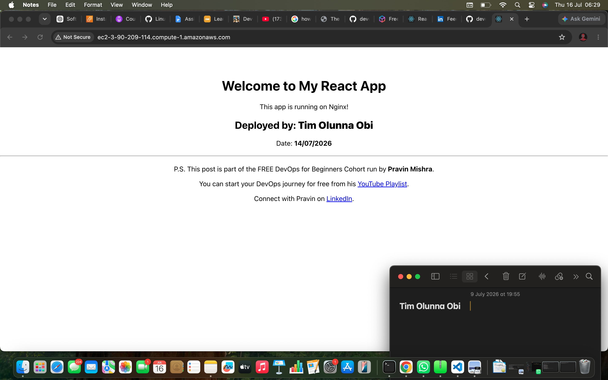

---

#### Screenshot 2 — Output of `ip a`

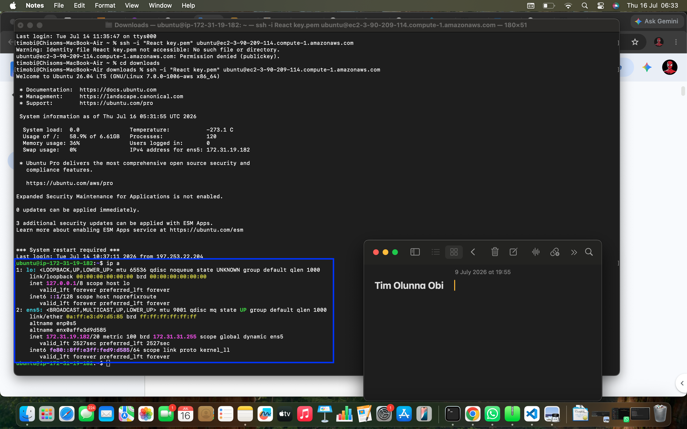

---

#### Screenshot 3 — Output of `sudo ss -tulpen`

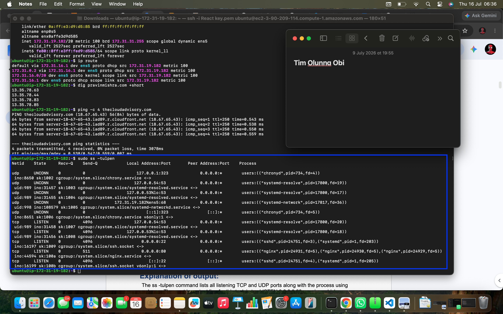

---

#### Screenshot 4 — Output of `sudo ufw status`

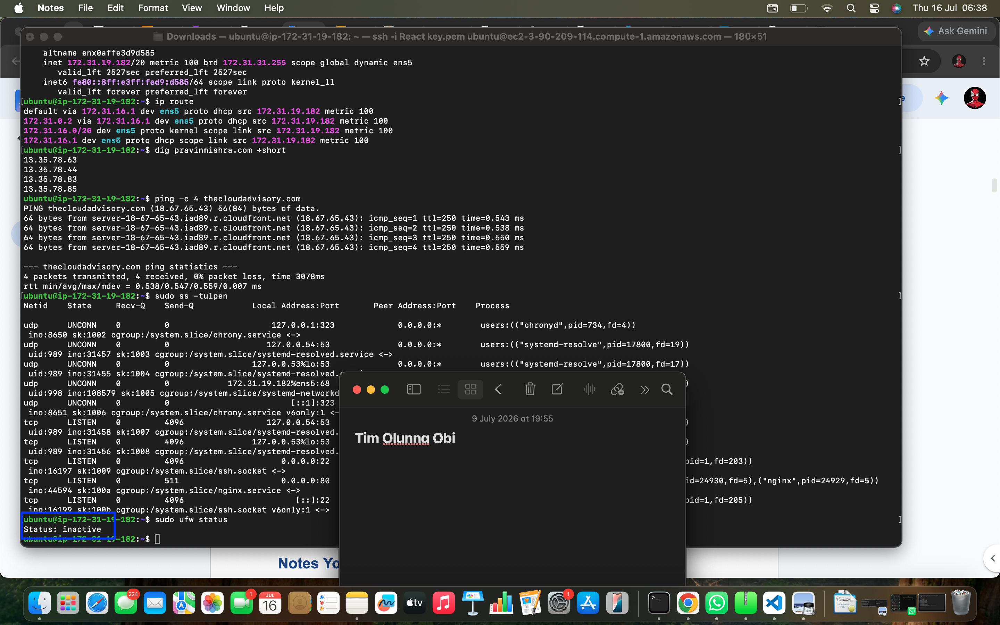

---

### Notes

Answer the following in your own words:

**1. What proves Nginx is listening on 0.0.0.0:80?**

The line tcp LISTEN 0.0.0.0:80 ... nginx confirms this in the sudo ss -tulpen output.

---

**2. What proves SSH is active on port 22?**

The ss -tulpen also shows an output of tcp LISTEN 0.0.0.0:22 ... sshd, confirming the SSH daemon (sshd) is actively listening on port 22 across all interfaces

---

**3. Did you find any unexpected open ports? Explain briefly.**

No unexpected open ports were detected. In addition to Nginx (port 80) and SSH (port 22), the only other listening services were chronyd (used for time synchronization) and systemd-resolved (used for DNS resolution). These services were bound only to the loopback addresses (127.0.0.1, 127.0.0.53, and 127.0.0.54), making them inaccessible from external networks. This confirms that only the intended services—Nginx for web traffic and SSH for remote access—are exposed externally.

---

# Task 2 — Service Health & Systemd Validation (Nginx)

## Goal

Verify that Nginx is properly installed, running, enabled at boot, and safely configured.

### Evidence

#### Screenshot 1 — Output of `systemctl status nginx --no-pager`

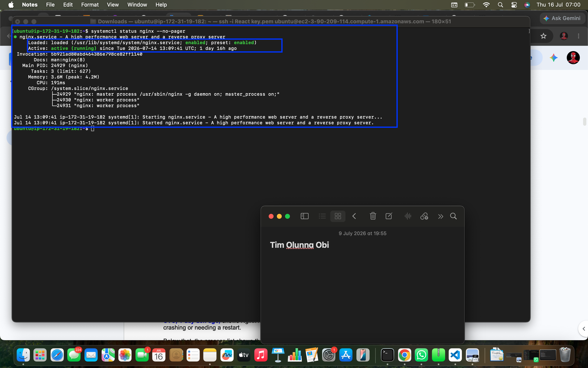

---

#### Screenshot 2 — Output of `sudo nginx -t`

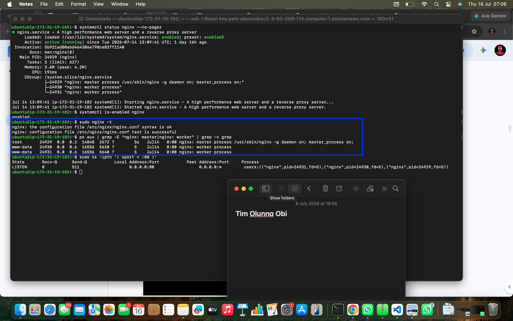

---

#### Screenshot 3 — Output of `sudo ss -lptn '( sport = :80 )'`

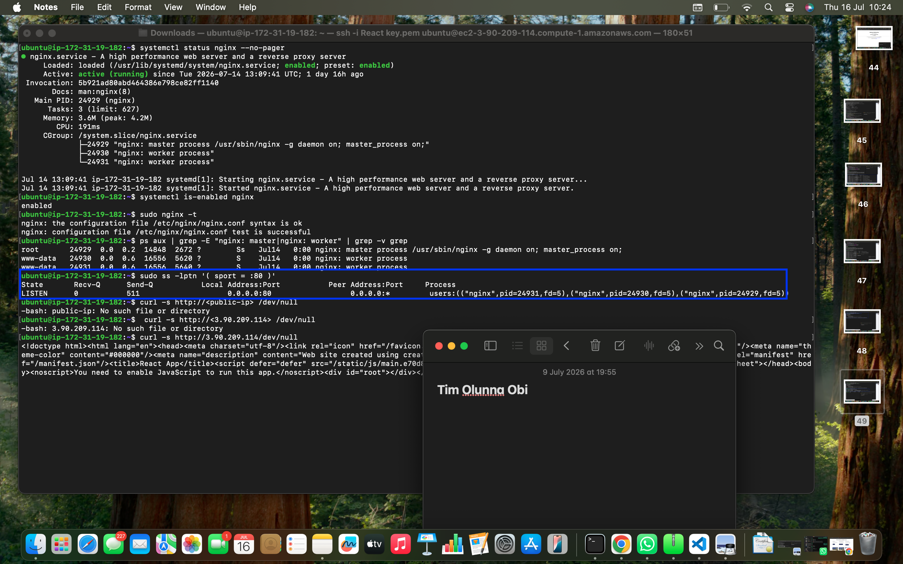

---

### Notes

Answer the following in your own words:

**1. What happens if Nginx fails to restart in production?**

If Nginx fails to restart, the website will become inaccessible because it is the only service listening for HTTP requests on port 80. As a result, users attempting to access the site will encounter connection errors or timeouts, since no process will be available to handle incoming web traffic. This can be particularly problematic during deployments or configuration updates, as a failed restart could cause unexpected downtime and require manual troubleshooting and intervention to restore the service.

---

**2. What's your basic rollback plan?**

Before applying any configuration changes, always run sudo nginx -t to verify the configuration syntax. This helps identify and fix errors before restarting the service. If Nginx fails to restart, the next step is to inspect the error logs using systemctl status nginx --no-pager and sudo journalctl -u nginx --no-pager -n 50. These commands provide detailed error messages that can be used to diagnose and resolve the issue quickly.

---

# Task 3 — Logs & Request Trace

## Goal

Verify real traffic flow and analyze logs to understand system behavior and errors.

### Evidence

#### Screenshot 1 — Output of `sudo tail -n 30 /var/log/nginx/access.log`

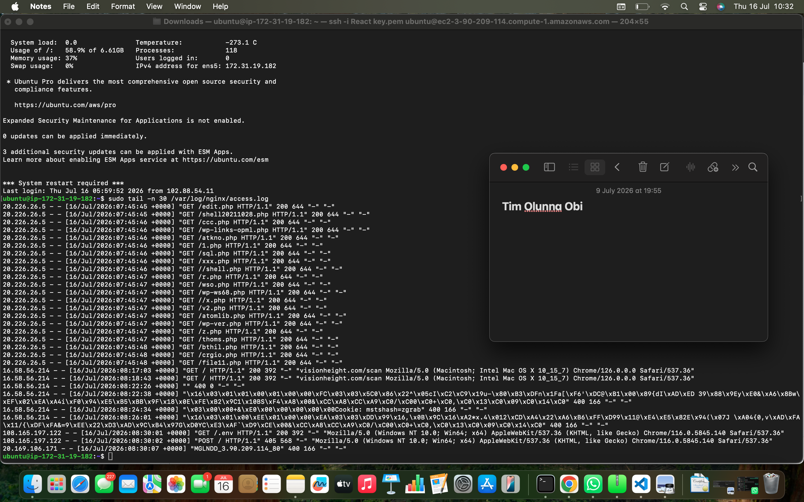

---

#### Screenshot 2 — Output of `sudo tail -n 30 /var/log/nginx/error.log`

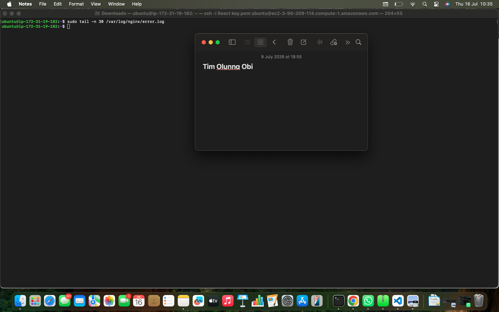

---

#### Screenshot 3 — Output of `sudo journalctl -u nginx --no-pager -n 50`

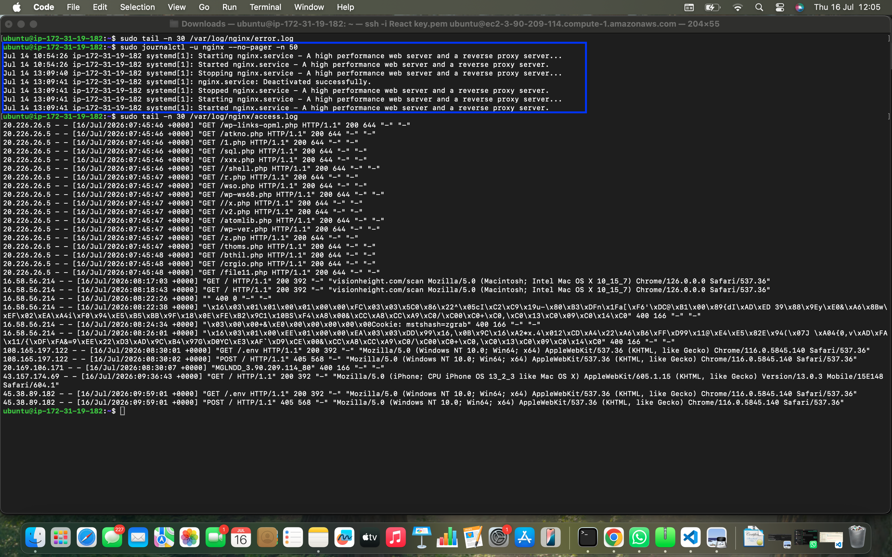

---

### Notes

Answer the following in your own words:

**1. Were there any errors in the logs?**

- If yes, mention 1–2 example error lines from the logs and explain what each one means in simple terms.
- If no, explain what it means if the error log is empty or shows no recent errors during your check.

No, there were no errors in the logs. Running sudo tail -n 30 /var/log/nginx/error.log produced no output, indicating that the Nginx error log was empty or contained no recent error entries. This means Nginx has not encountered any issues significant enough to be recorded during the period checked, suggesting that the web server is running normally and handling requests without errors. An empty error log is generally a good sign, as it indicates there have been no recent configuration, startup, or runtime problems requiring attention.

---

**2. If there were no errors, what does that indicate about the system?**

If there were no errors, it indicates that the system is operating normally and Nginx is functioning as expected. An empty or error-free log suggests there were no recent issues with starting the service, loading the configuration, or processing client requests. It also indicates that the web server has been running stably without encountering problems that require administrator attention. While this is a positive sign, it is still good practice to monitor the logs regularly to detect any future issues early.

---

**3. Based on the access logs, were your curl requests visible in the log entries? What does that prove about traffic flow?**

Yes, my requests were visible in the access logs. The log contains GET / HTTP/1.1 entries with a 200 OK status, confirming that my requests reached the Nginx server and were successfully processed. This proves that traffic is flowing correctly from the client to the web server, Nginx is receiving incoming HTTP requests, and it is serving responses while recording each request in the access log.

---

# Task 4 — System Resource Health Check (Capacity Red Flags)

## Goal

Assess server capacity and detect potential performance or failure risks.

### Evidence

#### Screenshot 1 — Output of `uptime`

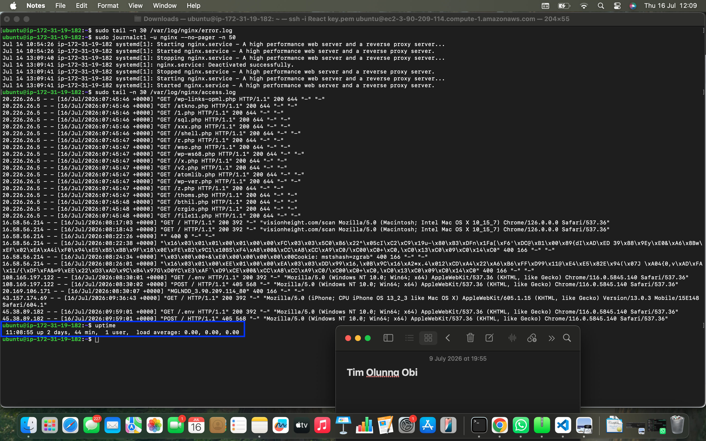

---

#### Screenshot 2 — Output of `free -h`

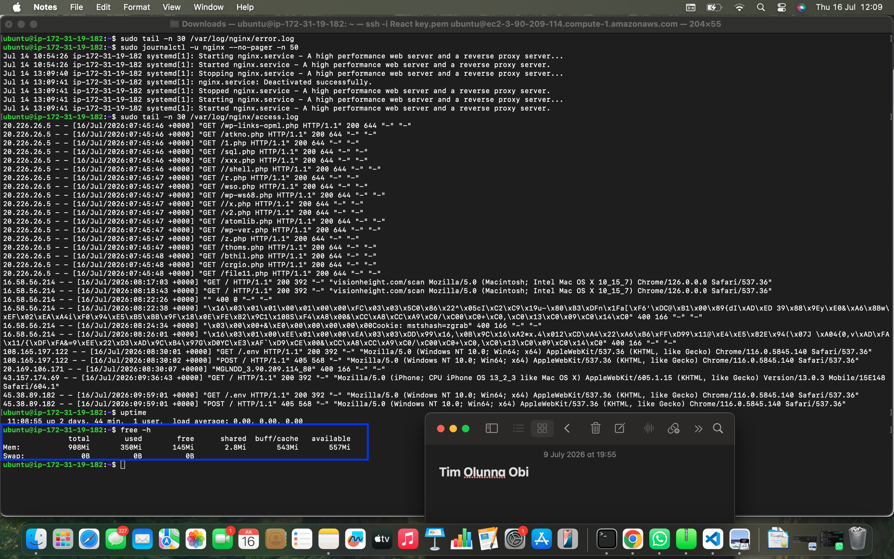

---

#### Screenshot 3 — Output of `df -h`

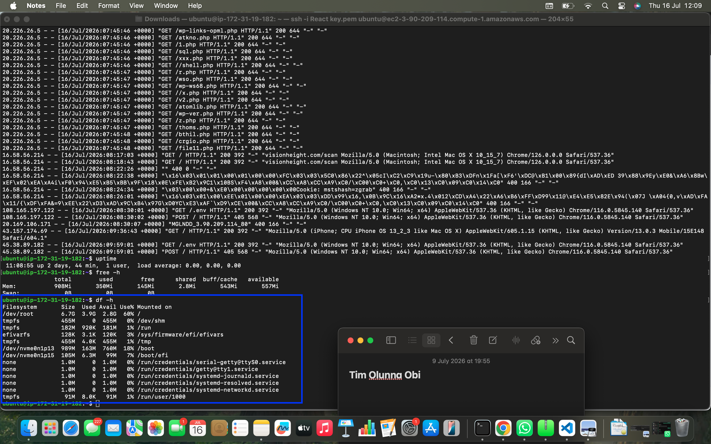

---

#### Screenshot 4 — Output of `sudo du -sh /var/* | sort -h`

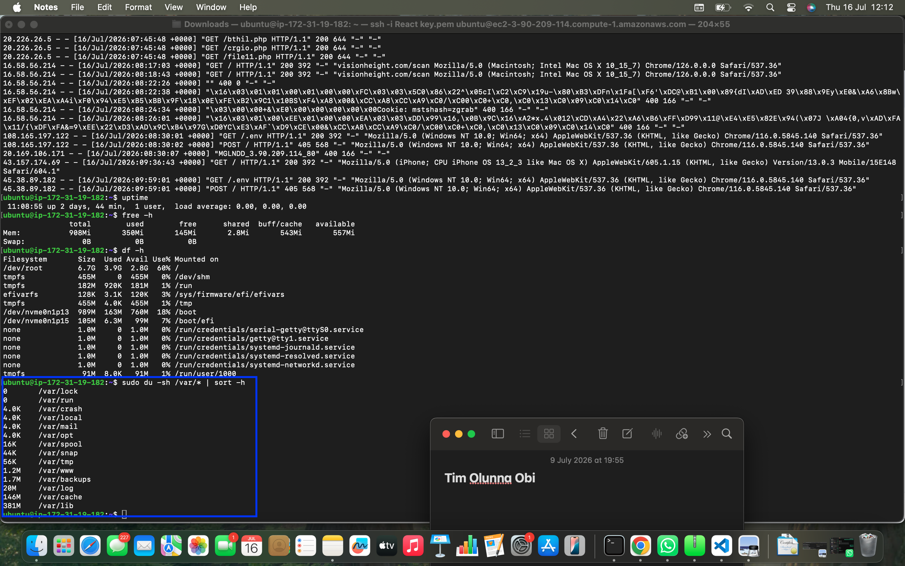

---

### Notes

Answer the following in your own words:

**1. Which resource looks most critical right now? (CPU/load, memory, or disk) Explain why.**

Disk usage is the most critical resource to monitor. Although it is currently only 60% utilized, it has a finite amount of remaining space (2.8 GB). The CPU is idle with a load average of 0.00, and memory usage is within a healthy range, so neither CPU nor RAM is under pressure. Disk space is therefore the resource that requires the closest monitoring as log files, application data, and system updates can gradually consume the remaining capacity.

---

**2. What happens if disk becomes 100% full in a production server?**

If the disk reaches 100% capacity, the server can experience serious problems. Applications such as Nginx may be unable to write log files, databases may fail to save data, and system processes that need temporary storage can stop working correctly. Users may encounter application errors or downtime, and updates or new file uploads will fail. In severe cases, critical services may crash or become unresponsive until disk space is freed, making regular disk monitoring essential for maintaining system reliability.

---

# Task 5 — Configuration & Deployment Verification

## Goal

Ensure the correct React build is deployed and Nginx is serving it properly.

### Evidence

#### Screenshot 1 — Output of `ls -lah /var/www/html | head -n 20`

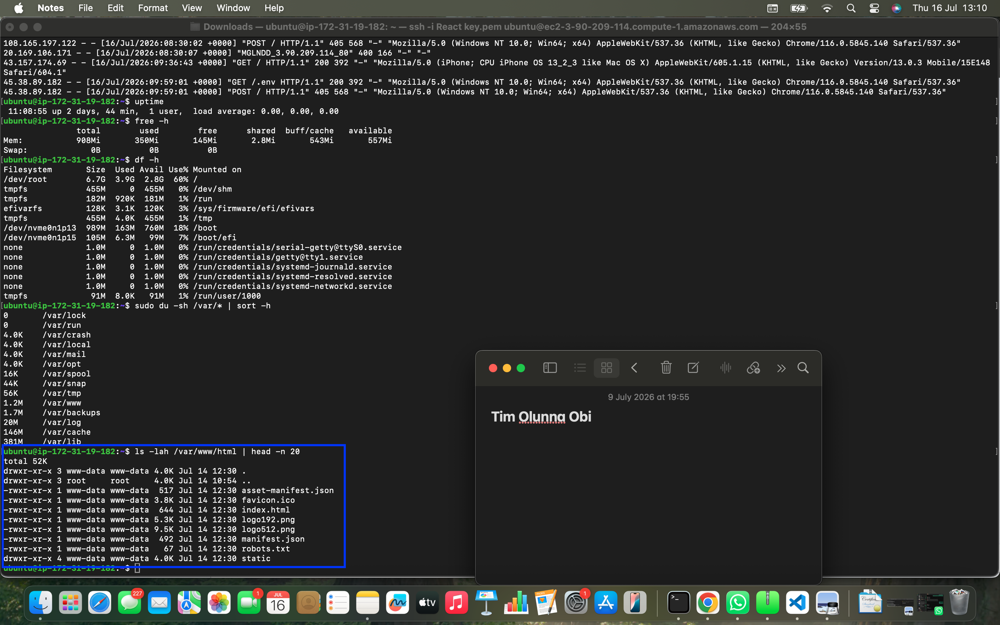

---

#### Screenshot 2 — Output of `grep -R "Deployed by" -n /var/www/html 2>/dev/null | head`

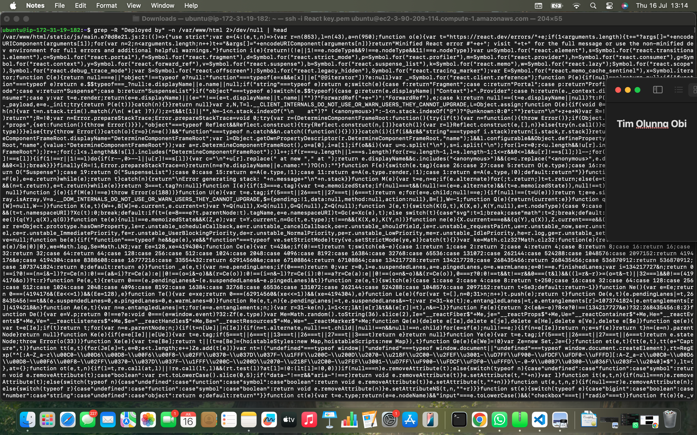

---

#### Screenshot 3 — Output of `grep -n "try_files" /etc/nginx/sites-available/default`

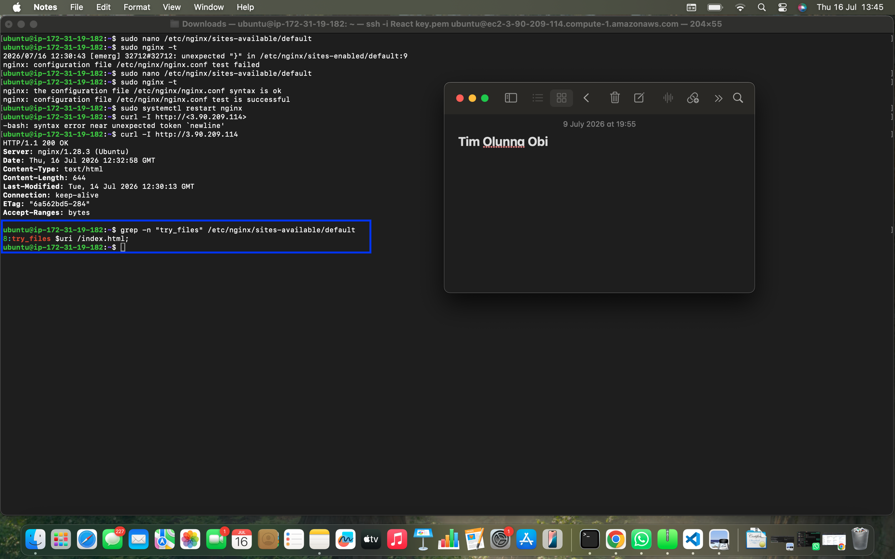

---

### Notes

Answer the following in your own words:

**1. How do you confirm that the correct version of the application is deployed?**

I confirmed the correct version was deployed by accessing the application's public URL and verifying that it displayed the latest changes. I also confirmed the deployment completed successfully, ensuring the server was running the most recent version of the application.

---

# Task 6 — Nginx Configuration Failure Simulation

## Goal

Simulate a real-world Nginx misconfiguration and recover the service safely.

### Evidence

#### Screenshot 1 — Output of `sudo nginx -t` showing the syntax error (broken config)

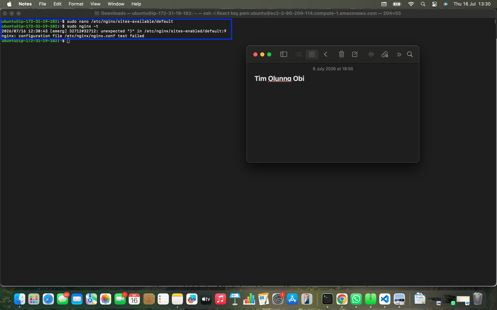

---

#### Screenshot 2 — Output of `sudo nginx -t` showing syntax ok (fixed config)

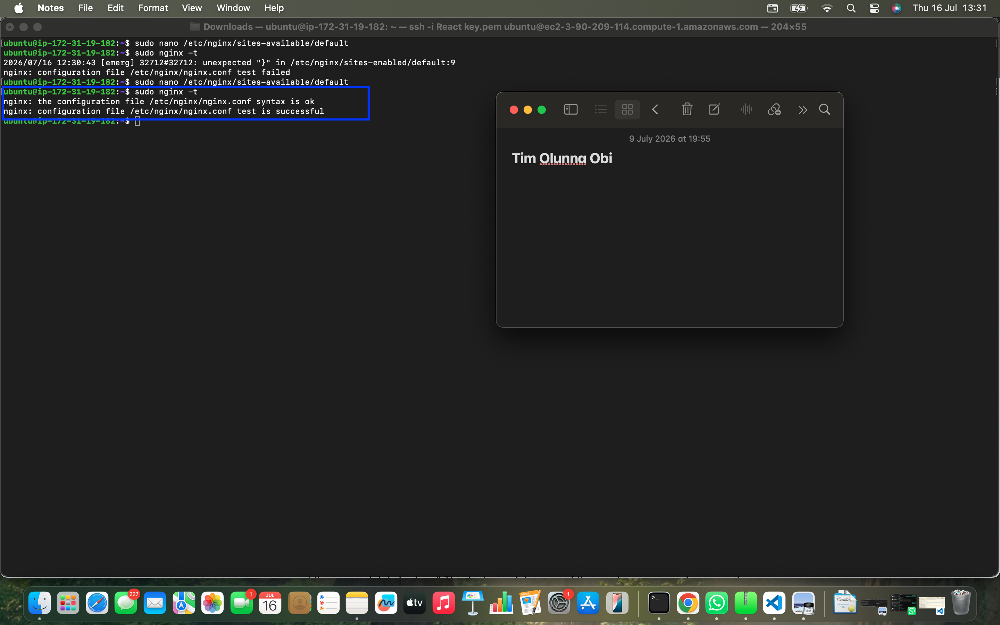

---

#### Screenshot 3 — Output of `curl -I http://<public-ip>` confirming recovery (200 OK)

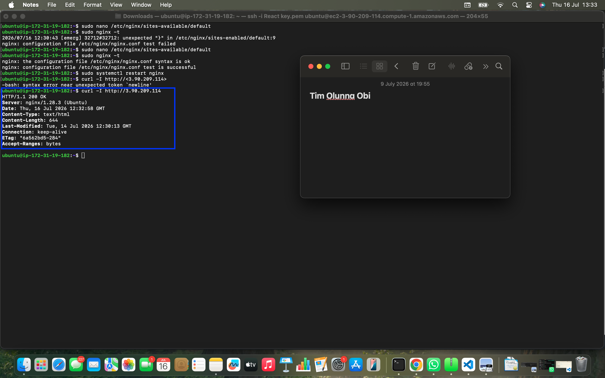

---

### Notes

Answer the following in your own words:

**1. What caused the configuration failure?**

Two missing semicolons in /etc/nginx/sites-available/default — one intentionally removed from the try_files $uri /index.html; directive as instructed, and a second one found missing from the error_page 404 /index.html; line. Either missing semicolon alone was enough to make Nginx's parser unable to correctly interpret the server block, causing a syntax error.

---

**2. How did you fix the issue?**

Reopened the config file and restored both missing semicolons, then re-ran sudo nginx -t to confirm the syntax was valid before restarting the service. Only after seeing syntax is ok / test is successful was systemctl restart nginx run, followed by an external curl -I check to confirm the live application was serving correctly again.

---

**3. How can you avoid this kind of issue in real production systems?**

Always run nginx -t after any config edit, without exception, before restarting or reloading.
Keep Nginx config files in version control (git), so a bad change can be instantly reverted to a known-good state instead of manually retyped from memory.
Use a staging environment to test config changes before they ever touch production.
Where possible, automate config validation as part of a deployment pipeline, so a broken config is caught in CI and never reaches the live server at all.

---

# Task 7 — Web Application Failure Simulation

## Goal

Simulate missing deployment content and recover the application safely.

### Evidence

#### Screenshot 1 — Output of `curl -I http://<public-ip>` showing failure (non-200 response)

Add your screenshot here.

---

#### Screenshot 2 — Output of `curl -I http://<public-ip>` confirming recovery (200 OK)

Add your screenshot here.

---

### Notes

Answer the following in your own words:

**1. What caused the application to break in this scenario?**

Write your answer here

---

**2. How did you fix the issue and restore the application?**

Write your answer here.

---

**3. What steps would you take to prevent this kind of issue in real production systems?**

Write your answer here.

---

# Task 8 — Security & Reliability Review

## Goal

Review and reflect on the security and reliability practices applied during this assignment.

### Security & Reliability Notes

Answer the following in your own words:

**1. Why is SSH key-based authentication more secure than sharing passwords?**

Write your answer here.

---

**2. Why should only required ports be open on a production server?**

Write your answer here.

---

**3. Why is it important for Nginx to be enabled on boot?**

Write your answer here.

---

**4. What are the risks of sharing secrets, keys, or credentials publicly?**

Write your answer here.

---

**5. Why should cloud resources be stopped or terminated when they are no longer needed?**

Write your answer here.

---

# LinkedIn Post (Required)

## Evidence

#### LinkedIn Post URL

Paste your LinkedIn post URL here:

`__________________________`

---

#### Screenshot — Published LinkedIn post

Add your screenshot here.

---

# Submission Instructions

- Add all required screenshots in your submission
- Full name must be visible in required screenshots
- Do not expose sensitive information (keys, passwords, account IDs)

---

# Completion Checklist

- [ ] Task 1: Screenshots (browser, ip a, ss -tulpen, ufw status) + Notes answered
- [ ] Task 2: Screenshots (nginx status, nginx -t, ss port 80) + Notes answered
- [ ] Task 3: Screenshots (access log, error log, journalctl) + Notes answered
- [ ] Task 4: Screenshots (uptime, free -h, df -h, du -sh) + Notes answered
- [ ] Task 5: Screenshots (ls html, grep deployed by, grep try_files) + Notes answered
- [ ] Task 6: Screenshots (nginx -t fail, nginx -t pass, curl recovery) + Notes answered
- [ ] Task 7: Screenshots (curl failure, curl recovery) + Notes answered
- [ ] Task 8: Security & Reliability Notes answered
- [ ] LinkedIn post published and URL submitted
- [ ] Full Name visible in all required screenshots
- [ ] No sensitive data exposed

---

## 📌 About DMI & CloudAdvisory

DevOps Micro Internship (DMI) is a project-based DevOps program run by Pravin Mishra (The CloudAdvisory) focused on real-world execution, systems thinking, and career readiness.

It helps learners build strong DevOps foundations with hands-on experience.

---

## 📌 Resources

- 🌐 DMI Official Website: https://pravinmishra.com/dmi  
- 🎓 DevOps for Beginners (Udemy): https://www.udemy.com/course/devops-for-beginners-docker-k8s-cloud-cicd-4-projects/  
- 🎓 Agentic AI DevOps with Claude Code: https://www.udemy.com/course/ultimate-agentic-ai-devops-with-claude-code/  
- 🎓 DevOps with Claude Code: Terraform, EKS, ArgoCD & Helm: https://www.udemy.com/course/devops-with-claude-code-terraform-eks-argocd-helm/  
- ▶️ YouTube Playlist: https://www.youtube.com/playlist?list=PLFeSNDtI4Cho  
- 🔗 Pravin Mishra (LinkedIn): https://www.linkedin.com/in/pravin-mishra-aws-trainer/  
- 🏢 CloudAdvisory (LinkedIn): https://www.linkedin.com/company/thecloudadvisory/

---

*This submission is part of DevOps Micro Internship (DMI) Cohort 3 — Agentic AI Track.*