# Assignment 5 — Bash Script Automation Drill (OPS Checklist)

Part of the DevOps Micro Internship (DMI) Cohort 3 with Agentic AI

---

## Purpose

In this assignment, you will practice Bash scripting by building a series of small automation scripts covering environment setup, variables, arrays, loops, file conditionals, if-else logic, and functions. These scripts form the foundation of real-world Linux automation used in DevOps, cloud, and production support environments.

---

# Task 1 — Bash Environment & Workspace Setup

## Goal

Verify that Bash is available on your system and create a clean workspace for this assignment.

### Evidence

#### Screenshot 1 — Output of `echo $SHELL` and `bash --version`

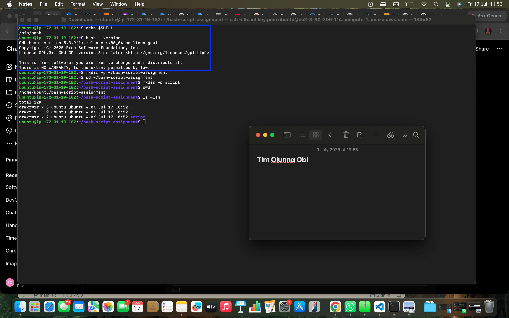

---

#### Screenshot 2 — Output of `pwd` and `ls -lah` showing the scripts directory

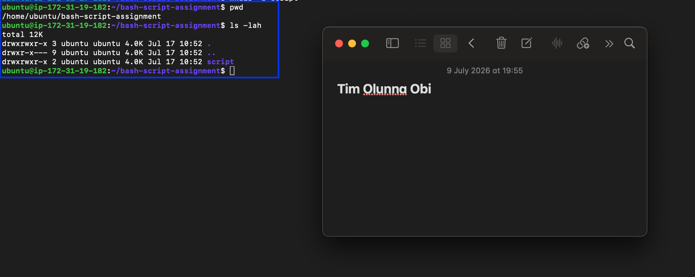

---

### Notes

Answer the following in your own words:

**1. What is Bash?**

Bash means Born Again Shell. It is a command-line shell and Scripting language used to interact with Linux and Unix Operating systems, execute commands, and automate repetitive tasks.

---

**2. What is the difference between shell and Bash?**

Shell is a general program that lets users interact with the operating system. They include Bash, zsh, fish, sh, ksh.
                                 While
Bash is a specific implementation of a shell. It executes commands and provides advanced scripting features.

---

**3. Why is it important to confirm the Bash version before writing scripts?**

It is important to confirm the Bash version before writing scripts because different Bash versions support different features. Checking the version ensures the script is compatible with the system and helps avoid errors caused by unsupported commands or syntax.

---

# Task 2 — Your First Bash Script

## Goal

Create your first Bash script, make it executable, and run it from the terminal.

### Evidence

#### Screenshot 1 — Content of `first-script.sh`

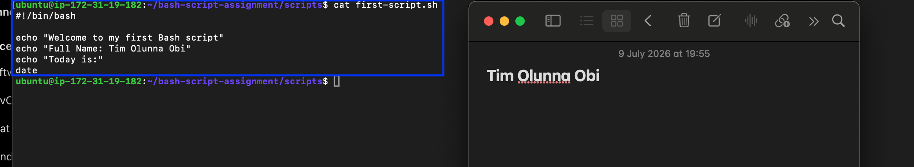

---

#### Screenshot 2 — Output of `./first-script.sh`

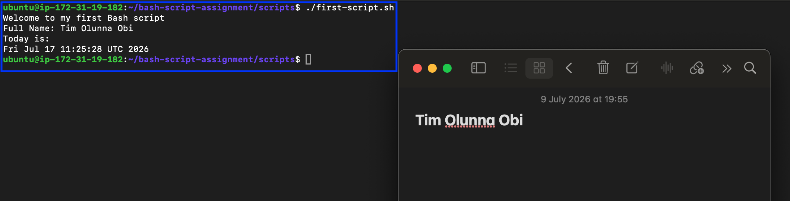

---

#### Screenshot 3 — Output of `ls -l first-script.sh` showing executable permission

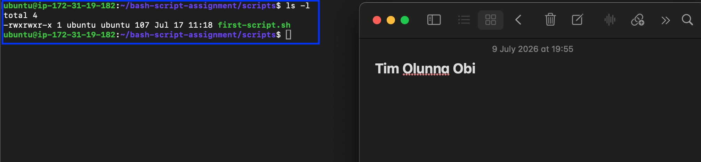

---

### Notes

Answer the following in your own words:

**1. What is the purpose of `#!/bin/bash`?**

#!/bin/bash is called the shebang. It tells Linux to execute the script using the Bash shell.

---

**2. Why do we use `chmod +x` before running a script?**

chmod +x gives the script execute permission, allowing it to be run as a program.

---

**3. What is the difference between running a script using `./script.sh` and `bash script.sh`?**

./script.sh runs the script directly and requires the script to have execute permission (chmod +x).

bash script.sh runs the script using the Bash interpreter and does not require execute permission.

---

# Task 3 — Variables: User Information Script

## Goal

Use variables to store and display user-related information.

### Evidence

#### Screenshot 1 — Content of `user-info.sh`

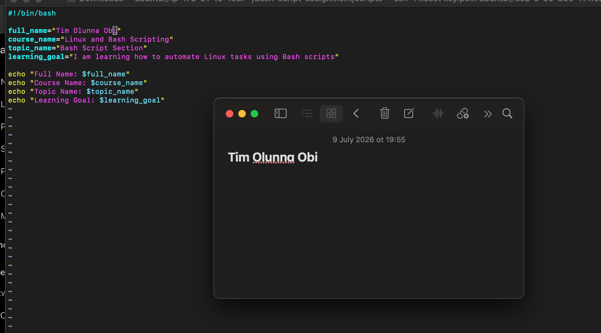

---

#### Screenshot 2 — Output of `./user-info.sh`

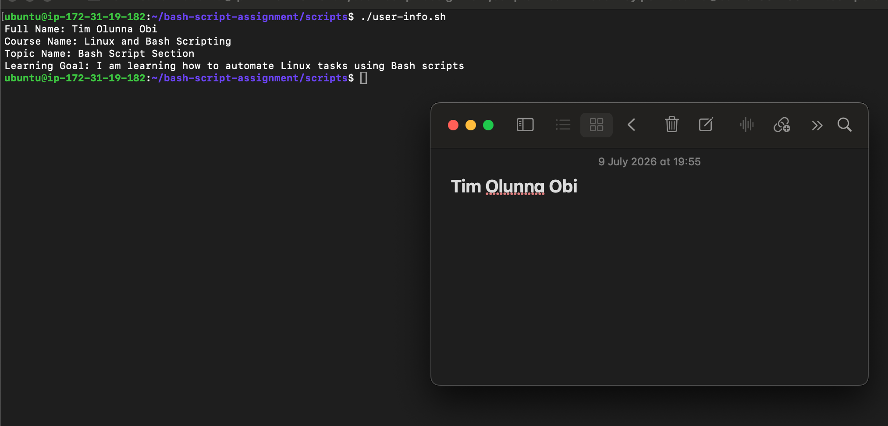

---

### Notes

Answer the following in your own words:

**1. What is a variable in Bash?**

A variable is a name that holds a value. A variable in Bash is a named container used to store data, such as text or numbers, so it can be reused throughout a script.

---

**2. Why should we avoid spaces around the `=` sign when creating variables?**

Because Bash treats spaces as separators between commands and arguments. Writing spaces around = causes a syntax error.

---

**3. How do you access the value stored inside a Bash variable?**

You access a variable's value by placing a $ before its name.

---

# Task 4 — Arrays & Loops: Tools Checklist Script

## Goal

Use arrays and loops to print a checklist of tools used in Bash scripting.

### Evidence

#### Screenshot 1 — Content of `tools-checklist.sh`

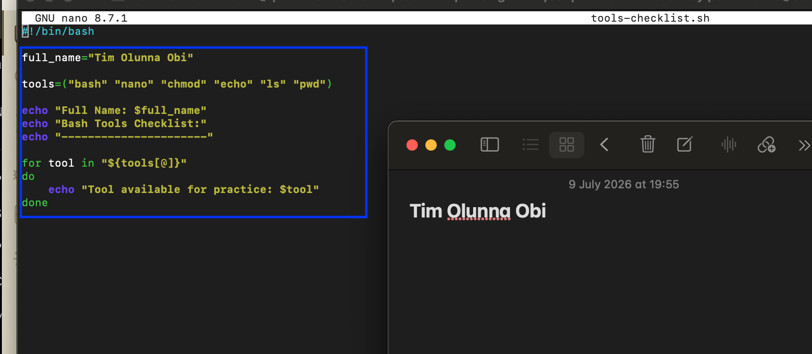

---

#### Screenshot 2 — Output of `./tools-checklist.sh`

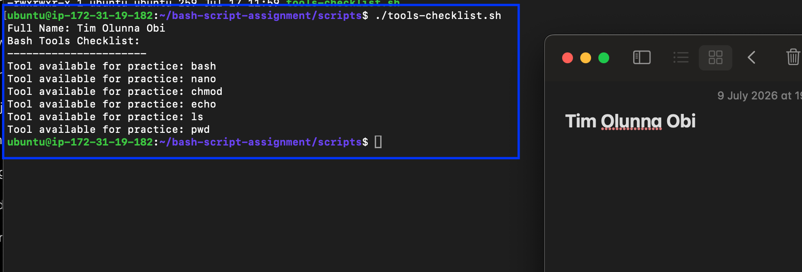

---

### Notes

Answer the following in your own words:

**1. What is an array in Bash?**

An array in Bash is a variable that stores multiple values under a single variable name.

---

**2. Why are arrays useful in scripts?**

Arrays allow you to store and manage multiple related values efficiently, making scripts shorter, easier to maintain, and ideal for processing lists with loops.

---

**3. What does `"${tools[@]}"` mean?**

"${tools[@]}" represents all the elements in the tools array, allowing the loop to access each item one at a time.

---

**4. What is the purpose of the `for` loop in this script?**

The for loop goes through each tool in the array and prints it, avoiding the need to write multiple echo commands manually.

---

# Task 5 — Loops: Number Counter Script

## Goal

Use loops to repeat a task multiple times.

### Evidence

#### Screenshot 1 — Content of `counter.sh`

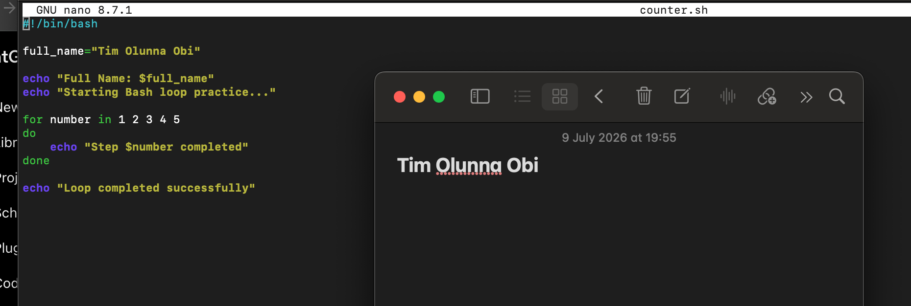

---

#### Screenshot 2 — Output of `./counter.sh`

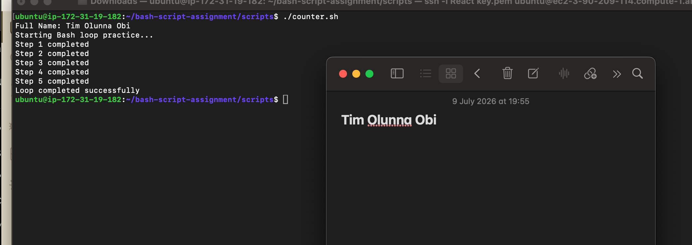

---

### Notes

Answer the following in your own words:

**1. What is a loop?**

A loop is a programming structure that repeatedly executes a block of code until a specified condition is met or all items have been processed.

---

**2. Why do we use loops in Bash scripting?**

Loops automate repetitive tasks, reduce duplicate code, and make scripts shorter and easier to maintain.

---

**3. How many times did the loop run in your script?**

The loop ran 5 times, once for each number from 1 to 5.

---

**4. What would you change if you wanted the loop to run 10 times?**

Change the list of numbers in the for loop to include 1 through 10

---

# Task 6 — Files & Conditionals: File Validation Script

## Goal

Use file checks and conditionals to verify whether files and directories exist.

### Evidence

#### Screenshot 1 — Output of `ls -lah ../test-folder`

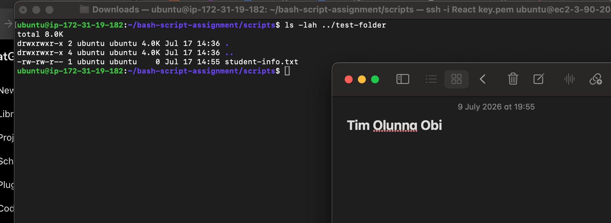

---

#### Screenshot 2 — Content of `file-check.sh`

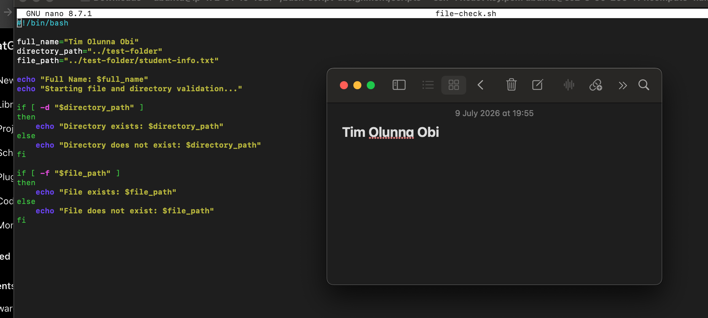

---

#### Screenshot 3 — Output of `./file-check.sh`

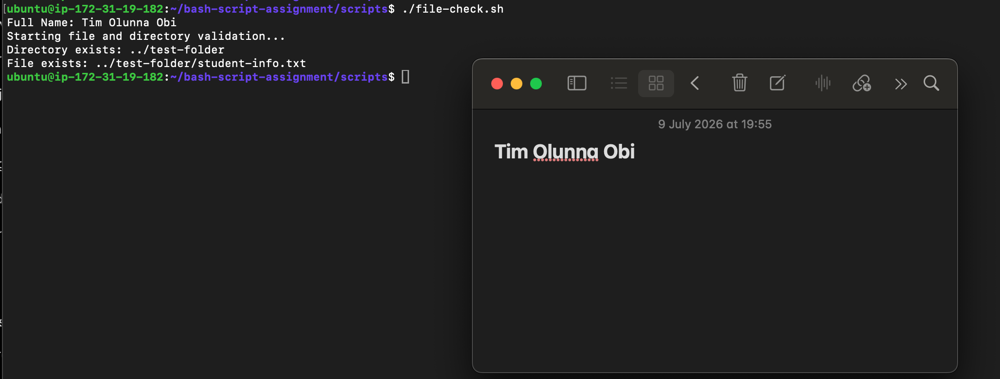

---

### Notes

Answer the following in your own words:

**1. What does `-d` check in Bash?**

-d checks whether the specified path exists and is a directory.

---

**2. What does `-f` check in Bash?**

-f checks whether the specified path exists and is a regular file.

---

**3. Why should file and directory paths be stored in variables?**

Storing paths in variables makes scripts easier to maintain, update, and reuse. If a path changes, you only need to update it in one place.

---

**4. What happens if the file does not exist?**

If the file does not exist, the -f condition evaluates to false, and the script executes the else block, displaying a message that the file does not exist.

---

# Task 7 — Conditionals: Pass or Retry Script

## Goal

Use if-else conditionals to make decisions based on a variable value.

### Evidence

#### Screenshot 1 — Content of `score-check.sh` with `score=85`

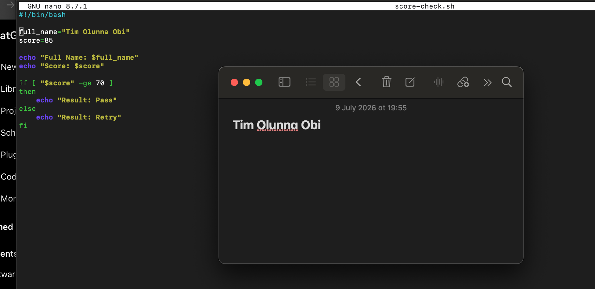

---

#### Screenshot 2 — Output showing `Result: Pass`

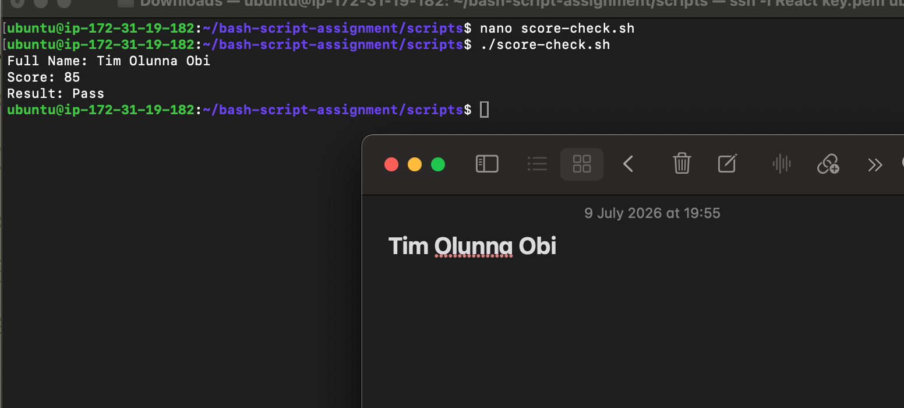

---

#### Screenshot 3 — Content of `score-check.sh` with `score=55`

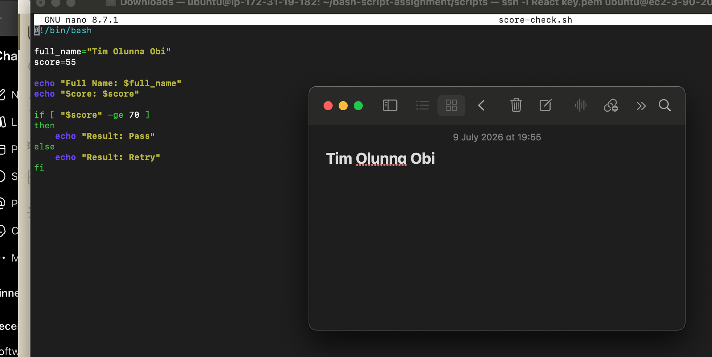

---

#### Screenshot 4 — Output showing `Result: Retry`

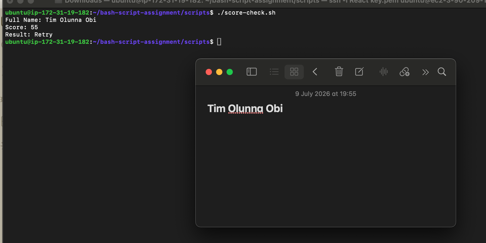

---

### Notes

Answer the following in your own words:

**1. What is the purpose of if-else in Bash?**

An if-else statement allows a Bash script to make decisions. It runs one block of commands when a condition is true and another block when the condition is false.

---

**2. What does `-ge` mean?**

-ge means greater than or equal to when comparing numbers in Bash.

---

**3. Why should conditions be tested with different values?**

Testing different values confirms that both the true and false parts of the condition work correctly.

---

**4. How can conditionals help in automation scripts?**

Conditionals allow scripts to respond automatically to different situations, such as checking scores, files, services, permissions, or system status.

---

# Task 8 — Functions: Final Bash Automation Script

## Goal

Create a final Bash script using functions to organize reusable code.

### Evidence

#### Screenshot 1 — Content of `final-automation.sh`

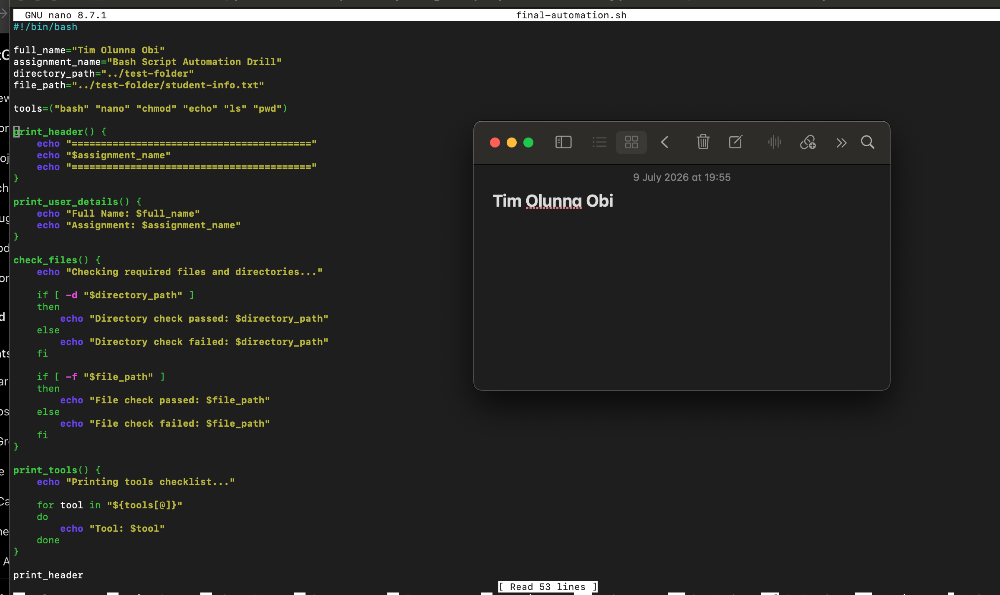

---

#### Screenshot 2 — Output of `./final-automation.sh`

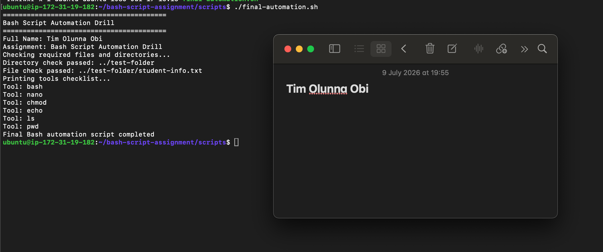

---

#### Screenshot 3 — Output of `ls -lah` showing all created scripts

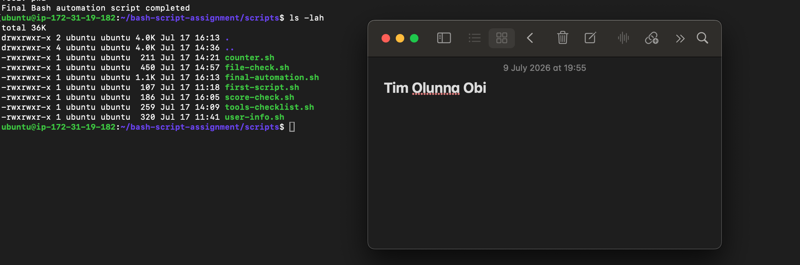

---

### Notes

Answer the following in your own words:

**1. What is a function in Bash?**

A function in Bash is a reusable block of commands that performs a specific task and can be called whenever needed.

---

**2. Why are functions useful in scripts?**

Functions make scripts easier to organize, read, reuse, test, and maintain. They also reduce repeated code.

---

**3. Which functions did you create in this script?**

print_header

print_user_details

check_files

print_tools

---

**4. How does this final script combine variables, arrays, loops, conditionals, files, and functions?**

The script uses variables to store the name, assignment name, and file paths. It uses an array to store Bash tools, a loop to print each tool, conditionals to check whether the file and directory exist, and functions to organize each task into reusable sections.

---

# LinkedIn Post (Required)

## Evidence

#### LinkedIn Post URL

Paste your LinkedIn post URL here:

https://www.linkedin.com/posts/tim-obi-40688a3a7_from-linux-commands-to-bash-automation-activity-7483924824109699072-WFC3?utm_source=share&utm_medium=member_desktop&rcm=ACoAAGOencYBw8GQRmlEqrn_AHS24OqmBpkIlVs

---

#### Screenshot — Published LinkedIn post

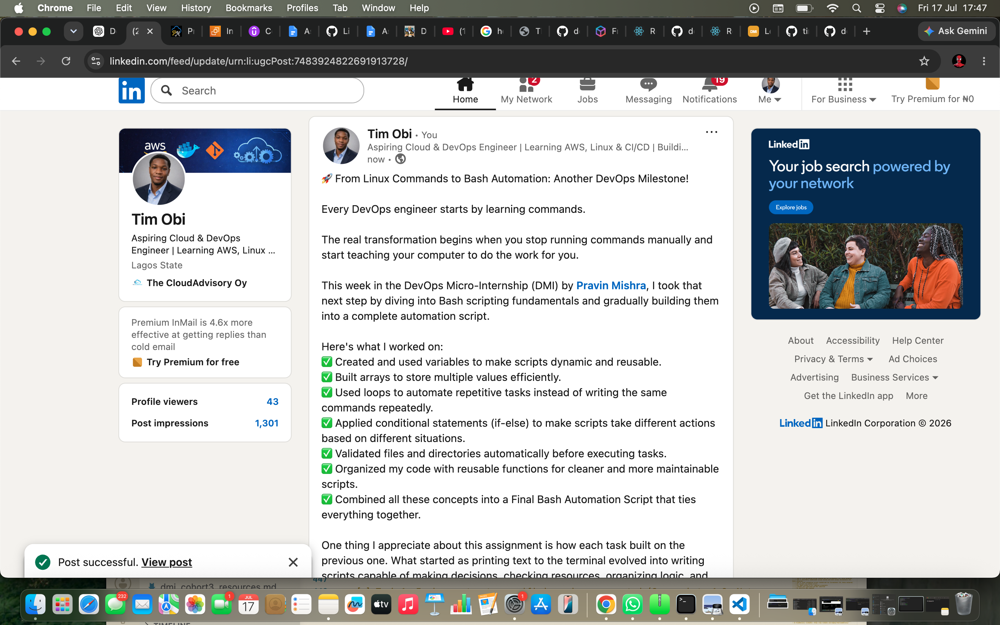

---

# Submission Instructions

- Add all required screenshots in your submission
- Full name must be visible in required screenshots
- All script files must be created and run successfully
- Required notes must be answered clearly for every task
- Do not expose sensitive information (keys, passwords, credentials)

---

# Completion Checklist

- [ ] Task 1: Environment setup verified, workspace created (Screenshots 1–2, Notes answered)
- [ ] Task 2: First script created, executed, permissions verified (Screenshots 1–3, Notes answered)
- [ ] Task 3: Variables script created and run (Screenshots 1–2, Notes answered)
- [ ] Task 4: Arrays and loops script created and run (Screenshots 1–2, Notes answered)
- [ ] Task 5: Counter loop script created and run (Screenshots 1–2, Notes answered)
- [ ] Task 6: File validation script created and run (Screenshots 1–3, Notes answered)
- [ ] Task 7: Pass/Retry conditional script tested with both values (Screenshots 1–4, Notes answered)
- [ ] Task 8: Final automation script created and run (Screenshots 1–3, Notes answered)
- [ ] All scripts run without errors
- [ ] Full Name visible in all required screenshots
- [ ] LinkedIn post published and URL submitted
- [ ] No sensitive data exposed

---

## 📌 About DMI & CloudAdvisory

DevOps Micro Internship (DMI) is a project-based DevOps program run by Pravin Mishra (The CloudAdvisory) focused on real-world execution, systems thinking, and career readiness.

It helps learners build strong DevOps foundations with hands-on experience.

---

## 📌 Resources

- 🌐 DMI Official Website: https://pravinmishra.com/dmi  
- 🎓 DevOps for Beginners (Udemy): https://www.udemy.com/course/devops-for-beginners-docker-k8s-cloud-cicd-4-projects/  
- 🎓 Agentic AI DevOps with Claude Code: https://www.udemy.com/course/ultimate-agentic-ai-devops-with-claude-code/  
- 🎓 DevOps with Claude Code: Terraform, EKS, ArgoCD & Helm: https://www.udemy.com/course/devops-with-claude-code-terraform-eks-argocd-helm/  
- ▶️ YouTube Playlist: https://www.youtube.com/playlist?list=PLFeSNDtI4Cho  
- 🔗 Pravin Mishra (LinkedIn): https://www.linkedin.com/in/pravin-mishra-aws-trainer/  
- 🏢 CloudAdvisory (LinkedIn): https://www.linkedin.com/company/thecloudadvisory/

---

*This submission is part of DevOps Micro Internship (DMI) Cohort 3 — Agentic AI Track.*