# Assignment 6 — Build an AI-Assisted Linux Health Check (AI-Assisted Linux Incident Triage)

Part of the DevOps Micro Internship (DMI) Cohort 3 with Agentic AI

---

## Purpose

In this assignment, you will build a read-only Bash triage script that checks the health of your Ubuntu server and Nginx application, connect it to Claude Code as a reusable `/linux-triage` skill, simulate a controlled Nginx incident, use the skill to gather and analyze evidence, recover the service manually, and verify recovery. The workflow follows the Agentic Loop: Gather → Analyze → Human Act → Verify.

---

# Task 1 — Confirm the Healthy Baseline and Create the Workspace

## Goal

Confirm that Nginx and the React application are healthy before building the automation.

### Evidence

#### Screenshot 1 — Output of `systemctl is-active nginx`, `ss -ltn | grep ':80'`, and `curl -I http://localhost`

---

#### Screenshot 2 — Output of `pwd` and `find . -maxdepth 4 -type d | sort` showing the workspace folder structure

---

### Notes

Answer the following in your own words:

**1. What proves that Nginx is running?**

The command systemctl is-active nginx returned active, confirming that the Nginx service is currently running.

---

**2. What proves that the server is listening for HTTP traffic?**

The command ss -ltn | grep ':80' showed that port 80 is in the LISTEN state, confirming that the server is accepting HTTP connections.

---

**3. Why must you capture a healthy baseline before simulating an incident?**

Capturing a healthy baseline provides a known working state to compare against after an incident. It helps identify what changed and makes troubleshooting more accurate and efficient.

---

# Task 2 — Create Project Context and Safety Rules in CLAUDE.md

## Goal

Tell Claude exactly what this project does and what it is not allowed to do.

### Evidence

#### Screenshot 3 — CLAUDE.md open in VS Code showing all four sections (Project Overview, Incident Workflow, Safety Rules, Output Rules)

---

### Notes

Answer the following in your own words:

**1. Why should Claude receive project-specific operational rules?**

Project-specific rules ensure Claude understands the system requirements, follows safe practices, and provides recommendations that align with the project's objectives.

---

**2. Why is the human required to execute the recovery command?**

Project-specific rules ensure Claude understands the system requirements, follows safe practices, and provides recommendations that align with the project's objectives.1

---

**3. Which rule prevents Claude from making an unsupported diagnosis?**

"Do not claim a root cause unless the report contains supporting evidence."

---

# Task 3 — Use Agentic AI to Plan Before Writing the Script

## Goal

Use Claude Code to inspect the environment and produce a read-only plan before creating any Bash code.

### Evidence

#### Screenshot 4 — Claude Code showing the five-check plan and read-only inspection results

---

### Notes

Answer the following in your own words:

**1. Which part of this task represents the Gather phase?**

The Gather phase is when Claude inspected the Ubuntu server using read-only commands to collect information about the system before making any changes. It gathered evidence about the Nginx service, port 80, HTTP response, disk usage, and available memory.

---

**2. Did Claude follow the instruction not to create files? How did you verify this?**

Yes. Claude followed the instruction by only using read-only commands to inspect the server and propose a Bash incident-triage plan. It did not create or modify any files during the task, and the output only contained inspection results and recommendations.

---

**3. Why is planning before coding useful in DevOps automation?**

Planning before coding helps identify the correct checks, reduces mistakes, avoids unnecessary changes to production systems, and ensures automation is based on accurate information gathered from the environment.

---

# Task 4 — Build the Linux Triage Bash Script

## Goal

Create one Bash script that gathers consistent Linux and Nginx health evidence.

### Evidence

#### Screenshot 5 — Top section of `linux-triage.sh` showing variables, thresholds, and the checks array

---

#### Screenshot 6 — Middle section showing check functions and conditionals

---

#### Screenshot 7 — Bottom section showing the loop, summary function, and exit behavior

---

#### Screenshot 8 — Output of `bash -n scripts/linux-triage.sh` (no syntax errors) and `ls -l scripts/linux-triage.sh` showing executable permission

---

### Notes

Answer the following in your own words:

**1. What is stored in the checks array?**

The checks array stores the names of the health-check functions that the script will execute. Each function performs a specific system check, such as checking the Nginx service, port 80, HTTP response, disk usage, or available memory.

---

**2. How does the `for` loop use that array?**

The for loop iterates through each function name stored in the checks array and executes them one by one. This ensures every health check runs automatically without repeating code.

---

**3. Why are the health checks separated into functions?**

Separating the health checks into functions makes the script more organized, reusable, and easier to maintain. Each function has a single responsibility, making debugging and future updates much simpler.

---

**4. What is the purpose of `$(...)` in this script?**

$() is used for command substitution. It runs a command and stores its output so it can be assigned to a variable or used elsewhere in the script.

---

**5. Why does the script use different exit codes for HEALTHY, WARN, and FAIL?**

Different exit codes allow other scripts, monitoring tools, and automation systems to quickly determine the health status of the server without reading the entire report. An exit code of 0 typically indicates a healthy state, while non-zero exit codes indicate warnings or failures that require attention.

---

# Task 5 — Run and Understand the Healthy-State Report

## Goal

Run the Bash script against the healthy server and verify that it creates a report.

### Evidence

#### Screenshot 9 — Output of `./scripts/linux-triage.sh` showing your Full Name and all five check results

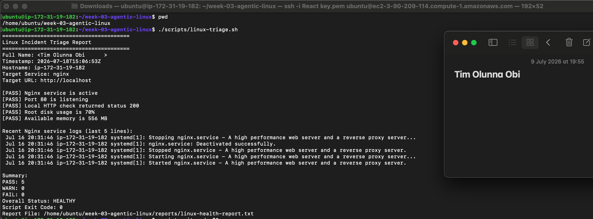

---

#### Screenshot 10 — Output showing the captured exit code and final summary

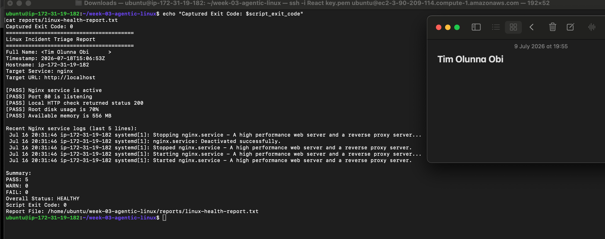

---

### Notes

Answer the following in your own words:

**1. What is the overall status of your healthy baseline?**

The overall status of my healthy baseline is HEALTHY, indicating that all health checks passed successfully and no failures were detected.

---

**2. Which exact Linux evidence proves the application is serving traffic?**

The evidence is the line "[PASS] Local HTTP check returned status 200", which confirms that the application is responding successfully to HTTP requests on localhost.

---

**3. Did your script return exit code 0 or 1? Explain why.**

The script returned exit code 0 because all health checks passed successfully, no FAIL results were found, and the server is in a healthy state.
---

**4. What is the difference between a warning and a failure in this script?**

A warning (WARN) indicates a condition that should be monitored but does not stop the application from working, while a failure (FAIL) indicates a critical problem that requires attention because it affects the health or availability of the service.

---

# Task 6 — Create and Run the /linux-triage Skill

## Goal

Turn the Bash script into a reusable, manually invoked Agentic AI workflow.

### Evidence

#### Screenshot 11 — `SKILL.md` showing the frontmatter, allowed tool restrictions, and safety rules

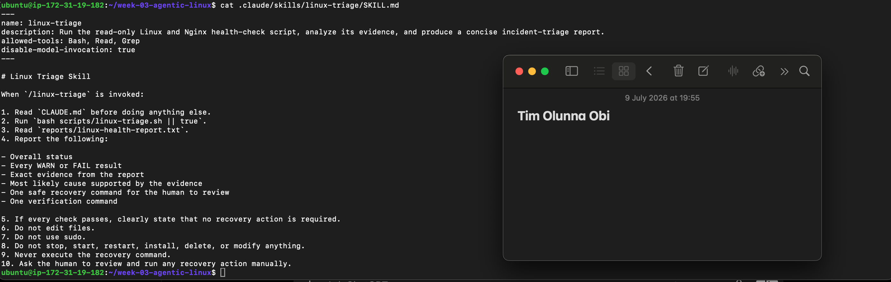

---

#### Screenshot 12 — `/linux-triage` output for the healthy server

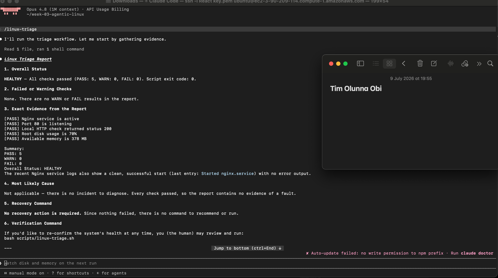

---

### Notes

Answer the following in your own words:

**1. Why does this skill have Bash, Read, and Grep, but not Write?**

The skill only needs to gather evidence and analyze system health. Bash executes the health-check script, while Read and Grep retrieve and search the report. The Write tool is intentionally excluded to prevent the skill from modifying files or making changes to the server.

---

**2. Why is `disable-model-invocation: true` useful for this skill?**

It ensures the skill follows the predefined workflow without invoking additional AI reasoning or other models. This makes the analysis consistent, predictable, and safe for read-only incident triage.
---

**3. What part is performed by Bash, and what part is performed by Claude?**

Bash performs the system health checks and generates the report. Claude reads the report, interprets the evidence, summarizes the findings, and recommends safe recovery and verification steps without changing the server.
---

**4. Why is this better than asking Claude "Is my server healthy?" without giving it evidence?**

Because the response is based on real system evidence rather than assumptions. The Bash script collects actual health data from the server, and Claude analyzes that data to provide an accurate and trustworthy assessment.
---

# Task 7 — Simulate an Nginx Incident and Let the Skill Diagnose It

## Goal

Create a controlled service failure, gather evidence through Bash, and let Claude analyze the evidence without taking recovery action.

### Evidence

#### Screenshot 13 — Output showing Nginx is inactive and the HTTP request fails

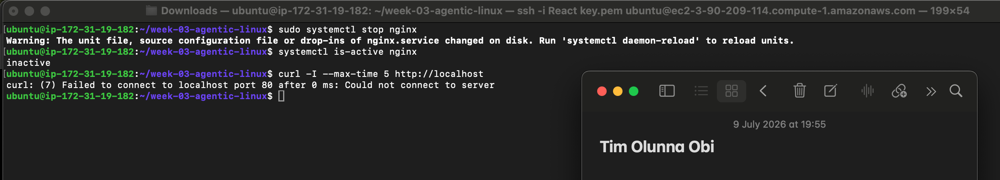

---

#### Screenshot 14 — `/linux-triage` output showing failed evidence, most likely cause, and a suggested recovery command

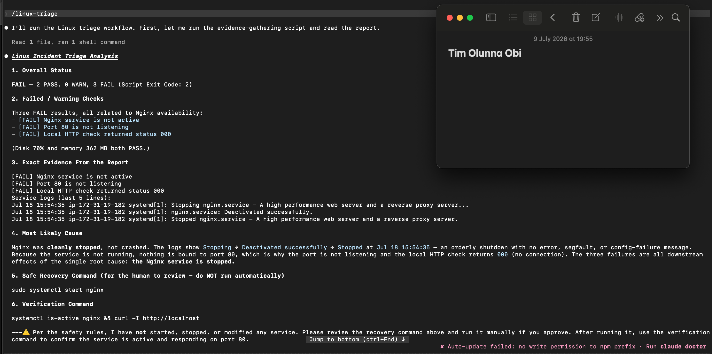

---

#### Screenshot 15 — `incident-failure-report.txt` showing the failed checks and your Full Name

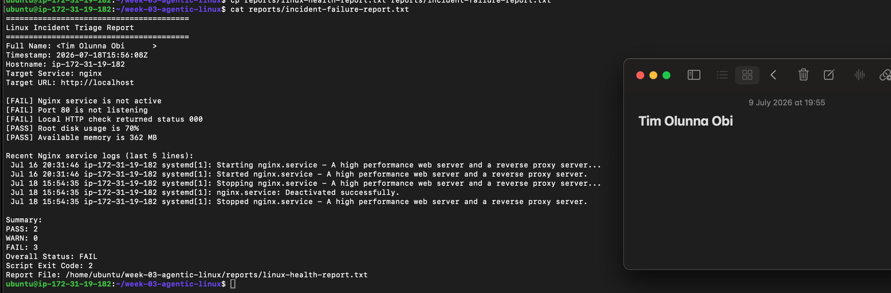

---

### Notes

Answer the following in your own words:

**1. Which three checks failed?**

The three checks that failed were:

Nginx service check

Port 80 listening check

HTTP response check

These failed because the Nginx service was stopped.

---

**2. What evidence supports the conclusion that Nginx is unavailable?**

The evidence includes the Nginx service being inactive, Port 80 not listening, and the local HTTP request failing to connect.

---

**3. Did Claude execute the recovery command? Why is that important?**

No. Claude only recommended the recovery command. This is important because it keeps the human in control and prevents unintended changes to the server.

---

**4. Which phase of the Agentic Loop is represented by the Bash report?**

The Bash report represents the Gather phase because it collects evidence from the system.

---

**5. Which phase is represented by Claude's explanation?**

Claude's explanation represents the Analyze phase because it interprets the collected evidence and identifies the likely cause.
---

# Task 8 — Recover Manually, Verify Again, and Write the Incident Summary

## Goal

Recover the service as the human operator and prove that the system is healthy again.

### Evidence

#### Screenshot 16 — Output showing Nginx is active and `curl -I http://localhost` returns 200 OK

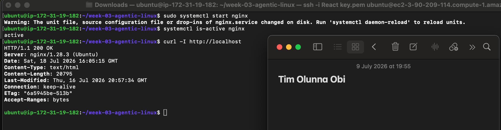

---

#### Screenshot 17 — Second `/linux-triage` output showing successful recovery with no FAIL results

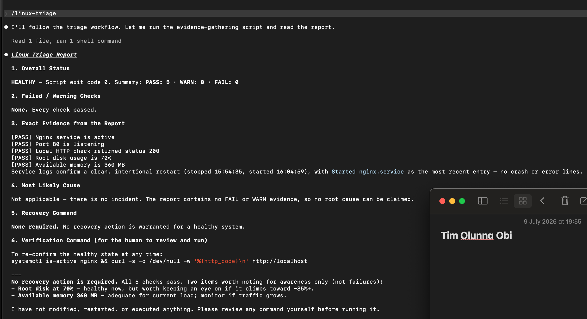

---

#### Screenshot 18 — Output of `ls -lah reports` showing both `incident-failure-report.txt` and `recovery-report.txt`

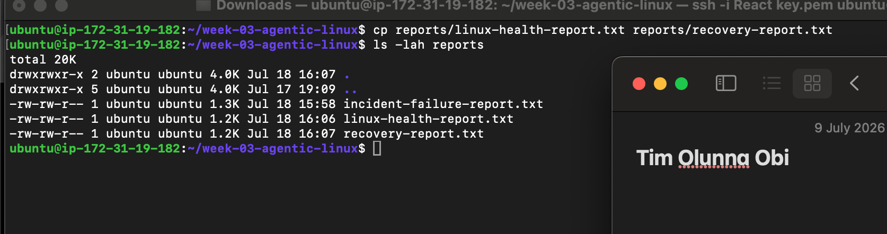
---

#### Screenshot 19 — `incident-summary.md` showing all required sections and your Full Name

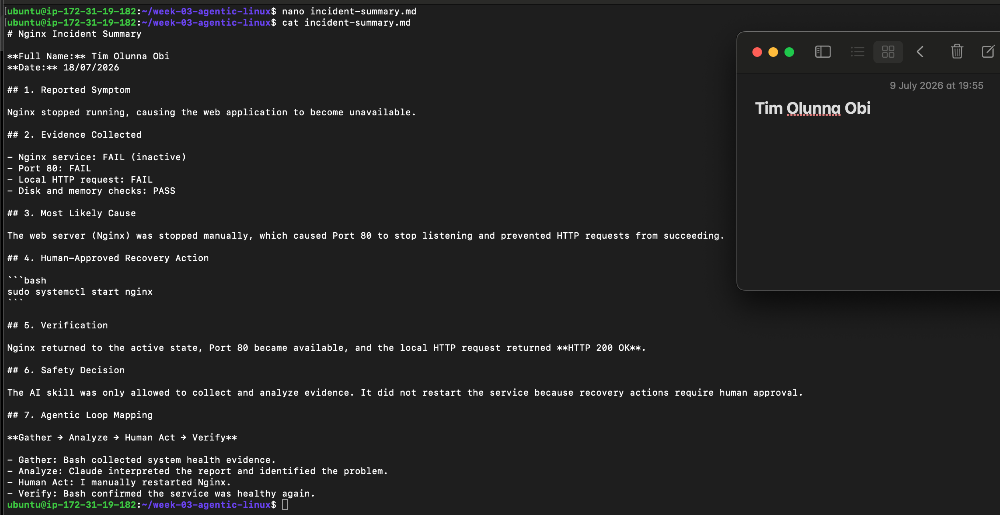

---

### Notes

Answer the following in your own words:

**1. What action did you execute manually?**

I manually executed sudo systemctl start nginx to restart the Nginx service.

---

**2. What evidence proves that the service recovered?**

The service status changed to active, the local HTTP request returned HTTP/1.1 200 OK, and the second /linux-triage report showed no failed checks.

---

**3. Why is the second triage run necessary?**

It verifies that the recovery was successful and confirms that all health checks are passing again.

---

**4. What could go wrong if an AI agent automatically restarted every failed service?**

It could hide the real root cause, interrupt running workloads, or make unintended changes that worsen the problem.

---

**5. In one sentence, explain the difference between using AI as a chatbot and using AI in this agentic workflow.**

A chatbot mainly answers questions, while an agentic AI workflow gathers real system evidence, analyzes it, and assists the human in making informed decisions without taking unauthorized actions.

---

# Incident Summary

Fill in all seven sections below in your own words.

**Full Name:** Tim Olunna Obi

**Date:** 18/06/2026

---

**1. Reported Symptom**

After stopping the Nginx service, the website became unavailable and the local HTTP request could no longer connect. This indicated that the web server was no longer serving traffic.

---

**2. Evidence Collected**

The Bash health report showed that the Nginx service was inactive, Port 80 was not listening, and the local HTTP check failed. Claude used this evidence to diagnose the problem without making any changes to the server.

---

**3. Most Likely Cause**

The most likely cause was that Nginx had been stopped manually. Since the service was no longer running, Port 80 closed and the web application could not respond to HTTP requests.

---

**4. Human-Approved Recovery Action**

After reviewing Claude's recommendation, I manually restored the service by running:

sudo systemctl start nginx

This returned the web server to a healthy state.

---

**5. Verification**

I confirmed the recovery by checking that the Nginx service was active, the local HTTP request returned HTTP/1.1 200 OK, and the second /linux-triage report showed that all health checks passed successfully.

---

**6. Safety Decision**

The AI skill was designed to collect and analyze evidence only. It was not allowed to restart Nginx automatically because recovery actions should always be reviewed and approved by a human to avoid unintended changes.

---

**7. Agentic Loop Mapping**

This incident followed the Agentic AI workflow:

Gather: Bash collected health information from the server.

Analyze: Claude examined the report and identified the failed checks.

Human Act: I manually restarted the Nginx service.

Verify: The health checks were run again to confirm the server had fully recovered.

---

# LinkedIn Post (Required)

## Evidence

#### LinkedIn Post URL

Paste your LinkedIn post URL here:

https://www.linkedin.com/posts/tim-obi-40688a3a7_week-3-of-my-devops-micro-internship-activity-7484017043898556416-zrUM?utm_source=share&utm_medium=member_desktop&rcm=ACoAAGOencYBw8GQRmlEqrn_AHS24OqmBpkIlVs

---

#### Screenshot — Published LinkedIn post

---

# GitHub Repository URL

Paste the URL of your GitHub folder or repository containing the assignment files here:

https://github.com/timobi784/devops-micro-internship-pravinmishra.git

---

# Submission Instructions

- Add all required screenshots in your submission
- Full Name must be visible in required screenshots and the Bash report
- All written answers must be in your own words
- Do not expose sensitive information (keys, passwords, AWS account IDs, tokens)
- GitHub URL must be included in this document

---

# Completion Checklist

- [ ] Task 1: Healthy baseline confirmed, workspace created (Screenshots 1–2, Notes answered)
- [ ] Task 2: CLAUDE.md created with all four sections (Screenshot 3, Notes answered)
- [ ] Task 3: Five-check plan produced by Claude using read-only tools (Screenshot 4, Notes answered)
- [ ] Task 4: `linux-triage.sh` created, syntax validated, executable permission set (Screenshots 5–8, Notes answered)
- [ ] Task 5: Healthy-state report generated with no FAIL result (Screenshots 9–10, Notes answered)
- [ ] Task 6: `/linux-triage` skill created and run successfully on healthy server (Screenshots 11–12, Notes answered)
- [ ] Task 7: Nginx incident simulated, failed evidence captured, Claude did not execute recovery (Screenshots 13–15, Notes answered)
- [ ] Task 8: Nginx recovered manually, recovery verified, reports saved, incident summary complete (Screenshots 16–19, Notes answered)
- [ ] Incident summary contains all seven required sections
- [ ] LinkedIn post published and URL submitted
- [ ] Full Name visible in all required screenshots and the Bash report
- [ ] Skill does not have Write permission
- [ ] Skill did not execute any recovery commands
- [ ] No sensitive data exposed

---

## 📌 About DMI & CloudAdvisory

DevOps Micro Internship (DMI) is a project-based DevOps program run by Pravin Mishra (The CloudAdvisory) focused on real-world execution, systems thinking, and career readiness.

It helps learners build strong DevOps foundations with hands-on experience.

---

## 📌 Resources

- 🌐 DMI Official Website: https://pravinmishra.com/dmi  
- 🎓 DevOps for Beginners (Udemy): https://www.udemy.com/course/devops-for-beginners-docker-k8s-cloud-cicd-4-projects/  
- 🎓 Agentic AI DevOps with Claude Code: https://www.udemy.com/course/ultimate-agentic-ai-devops-with-claude-code/  
- 🎓 DevOps with Claude Code: Terraform, EKS, ArgoCD & Helm: https://www.udemy.com/course/devops-with-claude-code-terraform-eks-argocd-helm/  
- ▶️ YouTube Playlist: https://www.youtube.com/playlist?list=PLFeSNDtI4Cho  
- 🔗 Pravin Mishra (LinkedIn): https://www.linkedin.com/in/pravin-mishra-aws-trainer/  
- 🏢 CloudAdvisory (LinkedIn): https://www.linkedin.com/company/thecloudadvisory/

---

*This submission is part of DevOps Micro Internship (DMI) Cohort 3 — Agentic AI Track.*