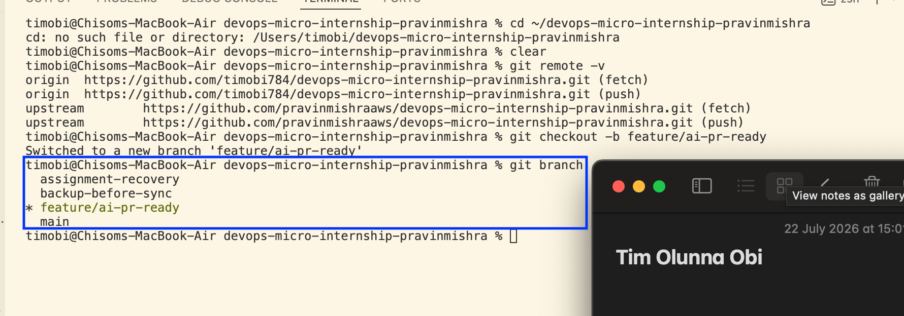
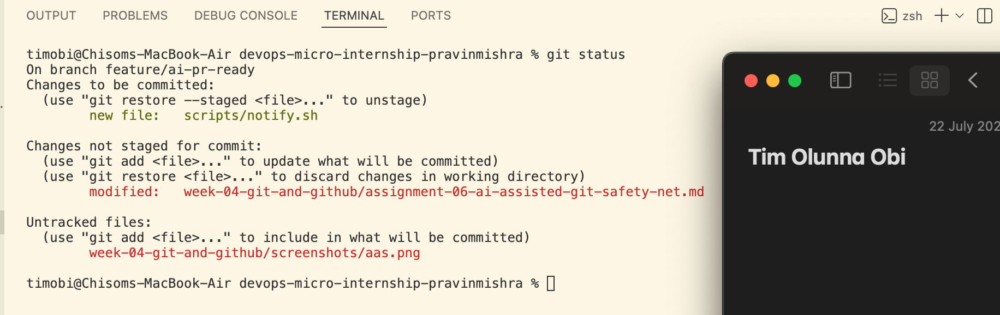
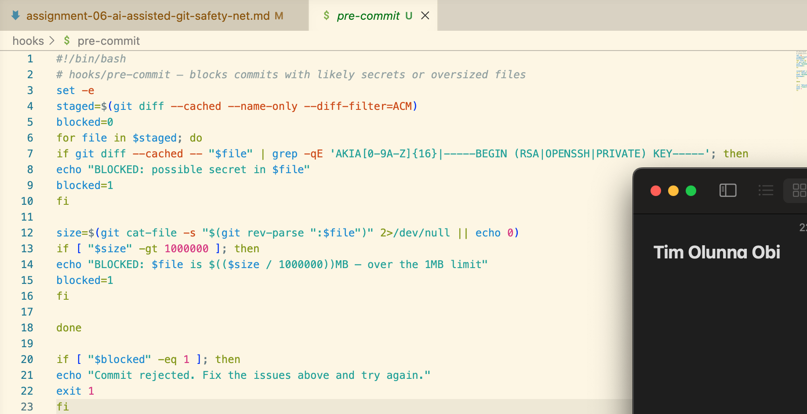
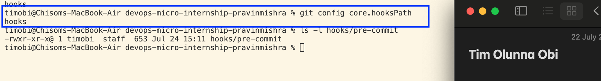
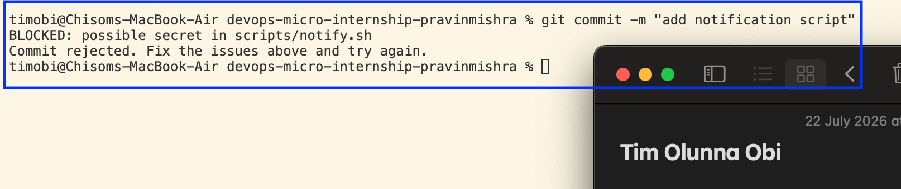
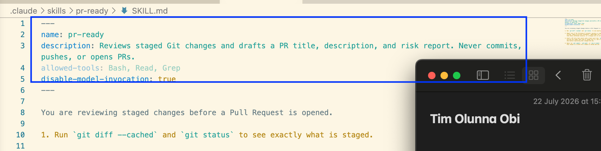
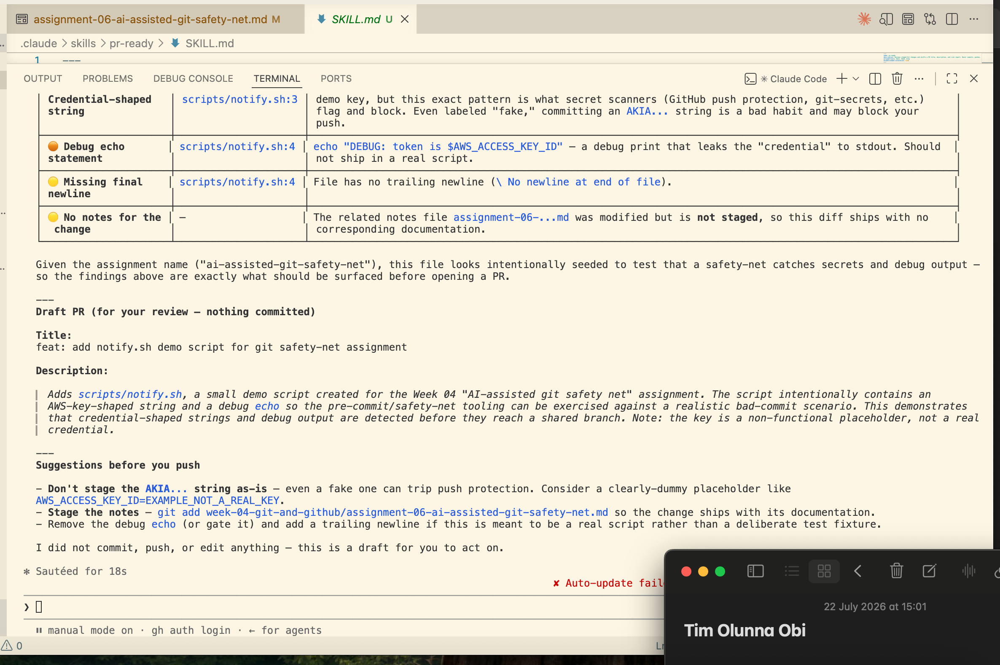
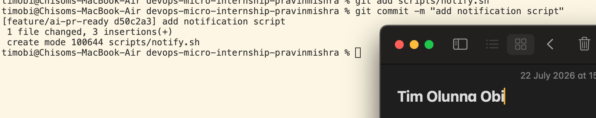
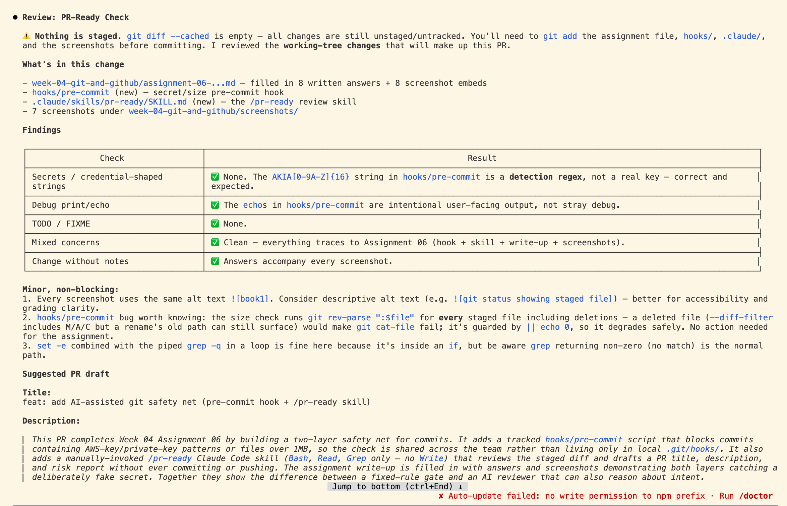
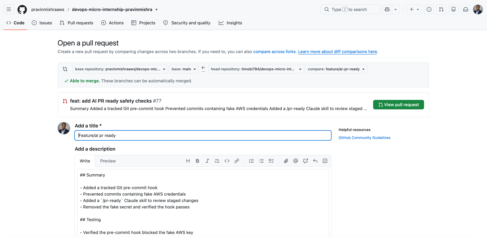

# Assignment 6 — Building an AI-Assisted Git Safety Net (PR Ready Check)

Part of the DevOps Micro Internship (DMI) Cohort 3 with Agentic AI

---

## Purpose

In Week 2 you built Claude Code hooks that block a dangerous action *before* it happens (`PreToolUse`), and a restricted skill that could look but not touch (`allowed-tools` without `Write`). In this assignment you will discover that Git has the exact same idea, decades older: a **pre-commit hook** that blocks a commit before it's created.

You will build both halves of a real "PR Ready" workflow:

1. A **Git hook that follows fixed rules** — scans staged changes for hardcoded secrets and oversized files and refuses the commit. No AI involved, no guessing, just a rule that gives the same answer every time.
2. A **restricted Claude Code skill** (`/pr-ready`) that reads your staged diff and drafts a Pull Request title, description, and a short list of things worth a second look — the kind of judgment a fixed rule can't make (mixed changes, missing context, unclear intent). The skill never commits, pushes, or opens the PR. You do that yourself, using its draft as a starting point.

This mirrors the Agentic Loop from Week 3's Linux triage assignment: **Gather → Analyze → Human Act → Verify**. The hook and the skill both gather and analyze; only you act.

---

# Task 0 — Confirm Your Fork and Create a Feature Branch

## Goal

Confirm you are working in your own fork, then create a dedicated branch for this assignment.

### Evidence

#### Screenshot 1 — Output of git remote -v and git branch showing the new branch

---

### Notes

**1. Why create a dedicated branch instead of doing this work on main?**

A dedicated branch keeps the assignment changes separate from the stable main branch. It allows me to work, test, and fix mistakes safely without affecting the main version of the repository. After confirming everything works correctly, the branch can be reviewed and merged into main.

---

# Task 1 — Stage a Change With Realistic Risk

## Goal

On your own fork of this repository (the one you've been submitting your DMI work in since onboarding), create a new branch and stage a change that a real reviewer should catch: a hardcoded-looking secret and a leftover debug statement.

### Evidence

#### Screenshot 1 — Output of  `git status` showing the staged file on feature/ai-pr-ready

---

### Notes

**1. Why does this assignment use an obviously fake key instead of a real one?**

A fake AWS key is used to safely demonstrate how secret detection works without exposing real credentials or creating a security risk.

---

# Task 2 — Write a Real Git Pre-Commit Hook

## Goal

Create a tracked, shareable pre-commit hook that blocks a commit containing secret-like patterns or files over 1MB.

### Evidence

#### Screenshot 2 — `hooks/pre-commit` open in VS Code showing the full script

---

#### Screenshot 3 — Output of `git config core.hooksPath` confirming it points to `hooks`

---

### Notes

**1. Why is `hooks/pre-commit` tracked in the repo instead of living only in `.git/hooks/`?**

The hook is tracked in the repository so it can be shared with the whole team and included in version control. Files inside .git/hooks/ are local to one computer and are not pushed to GitHub, so other team members would not automatically receive the same safety check.

---

**2. Compare this to `PreToolUse` from Week 2 Assignment 6. What does each one intercept, and what do they have in common?**

The Git pre-commit hook intercepts a Git commit before it is created and checks the staged files. PreToolUse intercepts a tool action before Claude executes it. Both act as safety gates: they inspect an action before it happens and can block it when it violates a rule.

---

# Task 3 — Prove the Hook Blocks the Risky Commit

## Goal

Attempt to commit the staged file from Task 1 and show the hook rejecting it.

### Evidence

#### Screenshot 4 — Terminal showing `git commit` rejected with the hook's "BLOCKED" message naming the exact file

---

### Notes

**1. Which line in `hooks/pre-commit` matched your fake key, and why did it match?**

This line matched the fake key:

grep -qE 'AKIA[0-9A-Z]{16}|-----BEGIN (RSA|OPENSSH|PRIVATE) KEY-----'

It matched because the fake AWS key starts with AKIA and is followed by 16 uppercase letters or numbers, which is the exact pattern the hook checks for.

---

**2. Could this hook have caught a poorly-named variable that stores a secret without the `AKIA` prefix? What does that tell you about the limits of a fixed rule like this?**

No. The hook only detects the specific patterns written into its rules. A secret without the AKIA prefix or private-key header could pass through unnoticed. This shows that fixed-rule checks are fast and consistent, but limited to the patterns they have been programmed to recognise.

---

# Task 4 — Build the `/pr-ready` Skill

## Goal

Create a manually invoked Claude Code skill that reads your staged changes and produces a PR-readiness report and a draft PR description — without writing, committing, or pushing anything itself.

### Evidence

#### Screenshot 5 — `SKILL.md` frontmatter showing `allowed-tools: Bash, Read, Grep` (no `Write`) and `disable-model-invocation: true`

---

#### Screenshot 6 — `/pr-ready` output while the risky file is still staged, showing it flagged the secret and/or debug statement

---

### Notes

**1. Why does `/pr-ready` have `Bash` and `Read` but not `Write`?**

Bash allows the skill to inspect Git evidence using commands such as git diff --cached and git status. Read lets it examine the relevant files. Write is excluded because the skill should only review and advise; it must not modify the code or make decisions on behalf of the engineer.

---

**2. The pre-commit hook and `/pr-ready` both looked at the same staged diff. Did they flag the same things? What did one catch that the other didn't?**

They both inspected the same staged change, but they served different purposes. The hook blocked the fake AWS-style key because it matched a fixed security pattern. /pr-ready could also identify the hardcoded key and additionally notice the debug echo statement and explain why the change was risky.

---

# Task 5 — Fix the Issues and Re-Verify

## Goal

Remove the secret and debug statement, then prove both gates now pass clean.

### Evidence

#### Screenshot 7 — `git commit` succeeding after the fix (no BLOCKED message)

---

#### Screenshot 8 — Second `/pr-ready` run showing a clean risk report and a drafted PR title + description

---

### Notes

**1. What exactly did you change to satisfy the pre-commit hook?**

I removed the fake AWS access key (AWS_ACCESS_KEY_ID=AKIA[REDACTED]) and deleted the debug statement that printed the key. I replaced them with a simple, safe message (echo "Notification script is ready."). These changes removed the secret-like pattern detected by the pre-commit hook and eliminated the security concern identified by the /pr-ready review, allowing the commit to pass successfully.

---

# Task 6 — Push and Open a Pull Request Using the AI Draft

## Goal

Push your branch and open a real Pull Request, using `/pr-ready`'s drafted title and description as your starting point — read it critically and edit before you use it.

**Important:** Open this Pull Request with base repository set to **your own fork** — not the shared upstream `pravinmishraaws/devops-micro-internship-pravinmishra` repository. This assignment's hook and skill files are your own practice work, not a change meant for the shared class repo.

### Evidence

#### Screenshot 9 — Your Pull Request showing the base repository is your own fork, plus the title and description, with the `/pr-ready` draft visible for comparison (paste it in the PR conversation or your notes below)

---

#### PR Link

https://github.com/pravinmishraaws/devops-micro-internship-pravinmishra/pull/77

---

### Notes

**1. What, if anything, did you edit in the AI's drafted PR description before using it? Why?**

I reviewed the AI-generated PR description and made small edits to ensure it accurately reflected the changes I made. I also improved the wording to make it clearer and more relevant to my work before submitting the Pull Request.

---

**2. If you had blindly copy-pasted the AI's draft without reading it, what could go wrong?**

The PR description could contain incorrect or incomplete information, which might confuse reviewers or misrepresent the changes I made. Reviewing it first helps ensure it is accurate, clear, and appropriate for the Pull Request.

---

**3. Why does this PR need to target your own fork instead of the shared upstream repository?**

The Pull Request should target my own fork because I do not have direct permission to make changes to the shared upstream repository. Working in my fork keeps my changes isolated, prevents accidental modifications to the original project, and allows my work to be reviewed safely before it is merged.

---

# Task 7 — Map the Workflow to the Agentic Loop

## Goal

Explain this assignment's workflow using the same Gather → Analyze → Human Act → Verify structure from Week 3.

### Notes

**1. Which step(s) represent Gather?**

Gather is when the pre-commit hook and the /pr-ready skill collect information about the staged changes using commands like git status and git diff --cached before making any decisions.

---

**2. Which step(s) represent Analyze?**

Analyze is when the pre-commit hook checks for patterns such as fake AWS keys or oversized files, and when the /pr-ready skill reviews the staged changes for secrets, debug statements, TODOs, and other potential issues before generating a PR draft.

---

**3. Which step is Human Act, and why must a human — not Claude — run `git commit`, `git push`, and open the PR?**

Human Act is when I review the AI's recommendations and decide to run git commit, git push, and create the Pull Request. A human must perform these actions because they change the repository, and only the developer should approve and take responsibility for those changes.

---

**4. Which step is Verify?**

Verify is when I confirm that the pre-commit hook allows the corrected commit, review the /pr-ready report after fixing the issues, and check that the Pull Request contains the correct information before submitting it.

---

**5. In one or two sentences: why do you need *both* the fixed-rule pre-commit hook and the AI skill? Isn't one enough?**

The pre-commit hook provides fast, automatic checks for predefined issues such as secrets and oversized files, while the AI skill performs a broader review and generates a helpful PR summary. Using both provides stronger protection because they catch different kinds of problems and complement each other.

---

# Task 8 — LinkedIn Post

## Goal

Publish a LinkedIn post summarizing what you built and what you learned about combining fixed-rule safety checks with AI-assisted review.

### Evidence

#### LinkedIn Post URL

https://www.linkedin.com/posts/tim-obi-40688a3a7_combining-git-safety-checks-with-ai-assisted-activity-7486451766604050432-EnH5?utm_source=share&utm_medium=member_desktop&rcm=ACoAAGOencYBw8GQRmlEqrn_AHS24OqmBpkIlVs

---

## Key Learnings

Add 3-5 bullet points on what you learned this week.

-Learned how to build a Git pre-commit hook to automatically block commits containing secrets and other risky changes before they enter the repository.

-Understood how AI-assisted code review can complement traditional Git workflows by identifying potential issues and drafting high-quality Pull Request descriptions.

-Saw the importance of combining fixed-rule automation with AI analysis, since each catches different types of problems.

-Learned that AI should recommend and draft, while developers should remain responsible for approving and executing Git operations like commit, push, and creating Pull Requests.

-Gained hands-on experience designing a safer development workflow that improves code quality, security, and collaboration before changes are merged.

---

# Submission Instructions

- Ensure `hooks/pre-commit` and `.claude/skills/pr-ready/SKILL.md` are committed to your GitHub repository
- Add all required screenshots to your submission
- All written answers must be in your own words
- Do not use a real secret or credential anywhere in your submission — the fake key in Task 1 is intentional and must stay clearly fake
- Open your Pull Request against your own fork, not the shared upstream repository
- Push your final changes to your forked repository
- Include your PR link and LinkedIn post URL

---

## GitHub Repository URL

Paste your forked repository URL here:

`Add your URL here`

---

# Completion Checklist

- [ ] Branch `feature/ai-pr-ready` created with a staged file containing a fake secret and a debug statement
- [ ] `hooks/pre-commit` created and tracked in the repo (not only in `.git/hooks/`)
- [ ] `core.hooksPath` configured to point at `hooks/`
- [ ] Pre-commit hook shown blocking the risky commit
- [ ] `.claude/skills/pr-ready/SKILL.md` created with correct `allowed-tools` (no `Write`) and `disable-model-invocation: true`
- [ ] `/pr-ready` run against the risky diff and shown flagging issues
- [ ] Risky file fixed; `git commit` succeeds cleanly
- [ ] `/pr-ready` re-run showing a clean report and drafted PR title/description
- [ ] Pull Request opened using the AI draft as a starting point, with your own fork as the base repository (not upstream), PR link included
- [ ] Agentic Loop mapping (Task 7) completed in your own words
- [ ] LinkedIn post published and URL submitted
- [ ] All required screenshots added
- [ ] GitHub repository URL provided

---

## 📌 About DMI & CloudAdvisory

DevOps Micro Internship (DMI) is a project-based DevOps program run by Pravin Mishra (The CloudAdvisory) focused on real-world execution, systems thinking, and career readiness.

It helps learners build strong DevOps foundations with hands-on experience.

---

## 📌 Resources

- 🌐 DMI Official Website: https://pravinmishra.com/dmi  
- 🎓 DevOps for Beginners (Udemy): https://www.udemy.com/course/devops-for-beginners-docker-k8s-cloud-cicd-4-projects/  
- 🎓 Agentic AI DevOps with Claude Code: https://www.udemy.com/course/ultimate-agentic-ai-devops-with-claude-code/  
- 🎓 DevOps with Claude Code: Terraform, EKS, ArgoCD & Helm: https://www.udemy.com/course/devops-with-claude-code-terraform-eks-argocd-helm/  
- ▶️ YouTube Playlist: https://www.youtube.com/playlist?list=PLFeSNDtI4Cho  
- 🔗 Pravin Mishra (LinkedIn): https://www.linkedin.com/in/pravin-mishra-aws-trainer/  
- 🏢 CloudAdvisory (LinkedIn): https://www.linkedin.com/company/thecloudadvisory/

---

*This submission is part of DevOps Micro Internship (DMI) Cohort 3 — Agentic AI Track.*
